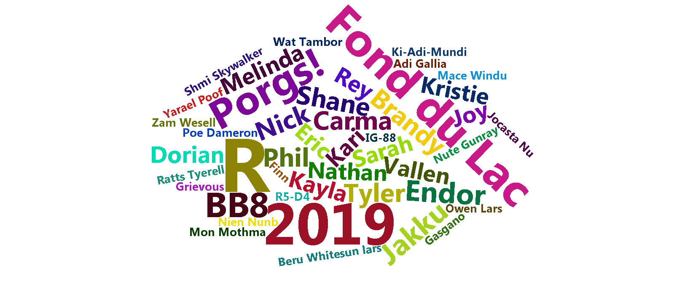
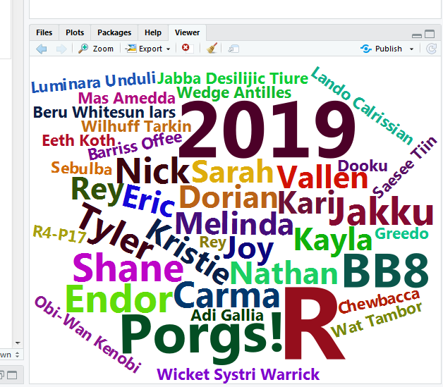

```{r setup, include=FALSE}
library("rmarkdown")
knitr::opts_chunk$set(error = TRUE)
htmltools::tagList(rmarkdown::html_dependency_font_awesome())
```


# Good morning! {-}
<hr>

<div>

</div>

<div>

</div>

We are  __Kristie__ & __Dorian__. Feel free to call us Kristie and Dory when you're feeling casual.   

We like __R__.

We are not computer scientists. 

We make lots of mistakes. Mistakes are funny. You can laugh with us. 

We aren't related.


## All together now {-}

Let's launch ourselves into the unknown and use R to make a `Word Cloud`. With a little copy and pasting we can make a cool image out of everyone's name in the class. Consider this an RStudio warm-up.

We're going to make this graphic, and you're going to make your name really <span style="font-size: 26px;"> __BIG__ </span>.

{style="width: 100%; margin-top: 12px;"}

1. Open R Studio

{style="width: 35%;"}

<br>

2. Copy the code below into your script in RStudio. Start with the line `install.packages` and end with the line `color = 'random-dark')`.

```{r wordcloud, eval=F}
install.packages(c("wordcloud2", "dplyr"))
library(wordcloud2)
library(dplyr)

class <- c("Kari"     = 8, 
           "Nathan"   = 8, 
           "Eric"     = 8, 
           "Carma"    = 9, 
           "Sarah"    = 8, 
           "Phil"     = 9, 
           "Brandy"   = 9, 
           "Kayla"    = 8, 
           "Shane"    = 9, 
           "Vallen"   = 8, 
           "Nick"     = 9,
           "Tyler"    = 9,
           "R"        = 26, 
           "2019"     = 20,
           "Fond du Lac" = 16,
           "Porgs!"    = 14,
           "Endor"     = 10,
           "Jakku"     = 10,
           "BB8"       = 12,
           "Rey"       = 8,
           "Melinda"   = 8, 
           "Kristie"   = 8, 
           "Joy"       = 8, 
           "Dorian"    = 8)

# Add 20 random Star Wars names as small text, size = 4
class <- c(class, rep(4, 20))

names(class)[(length(class)-19):length(class)] <- sample_n(starwars, 20)$name      

# Plot the Word Cloud
wordcloud2(data.frame(word = names(class), freq = class), 
           size  = 1, 
           color = 'random-dark')

```

<br>

3. In R Studio click on __File > New File > R Script__. You will see a code editor window open. 

{style="width: 65%; margin-bottom: 18px;"}

4. Paste the copied code into the upper left hand window. This is your code editor.  
5. Highlight all of the code and hit `CTRL + ENTER`.
6. You should see a Word Cloud pop up in the lower right of RStudio.
7. Now try increasing the number next to your name.  
8. Run the code again.
9. Make your name even __BIGGER!__


{width="75%"}

<br>

#### Congrats rebel droid! Your powers are growing. <i class="fa fa-android" style="font-size: 44px;"></i>  {-}


# Introductions {-}
<hr>

Let's introduce ourselves and the data we love _(or don't)_.

{align="right" style="width: 54%; margin-left: 26px; margin-top: 10px;"}

__Please share:__  

<div class="note" style="margin-top: -2px;">

- Your name  
- Types of data you have
- The messiest, weirdest, funniest part of your data
- Or something you have to do over and over again

__Hint:__ _Maybe this is something you can automate on the third day._ 

</div>

# | Why R? 
<hr>

See the [R Community](community.html) page.

## Data analysis in 7 steps {-}

<div class="note">

1. Read the data
1. Plot the data
1. Clean the data
1. View the data closer
1. Summarize the data
1. Save the results
1. __Share__ with the world
</div>

```{r create, include=F, eval=F, echo=F}
library(readxl)
library(tidyverse)

# Prepare example data
aqs <- read_excel("../data/2014_AQS_FondduLac.xlsx") %>%
       mutate(Date = as.Date(Date))

met <- read_csv("../data/COQ 2014 Processed MET -ASOS.csv") %>% 
       mutate(Date = as.Date(paste(Year, Month, Day, sep = "-")),
              Month = as.numeric(Month),
              Hour = as.numeric(Hour)) %>% 
       group_by(Date, Month, Day, Hour) %>% 
       summarize(TEMP_F = mean(TempF, na.rm = T))

aqs <- left_join(aqs, met)

aqs <- filter(aqs, Parameter == 88101, !is.na(TEMP_F))

aqs <- rename(aqs, OZONE = Conc, YEAR = Year, SITE = site_catid) %>%
       rowwise() %>%
       mutate(YEAR = 2017 - sample(-1:1, 1),
              Date = as.Date(paste(YEAR, Month, Day, sep = "-")))

aqs <- aqs %>%
       select(SITE, Date, Hour, OZONE, TEMP_F, everything()) %>%
       filter(Month > 3, Month < 11) %>% 
       group_by(SITE, Date) %>%
       mutate(OZONE  = max(OZONE, na.rm = T),
              TEMP_F = max(TEMP_F, na.rm = T)) %>% 
       slice(1)

aqs$UNITS <- "PPB"

aqs$UNITS[6] <- "PPM"
aqs$OZONE[6] <- aqs$OZONE[6] / 1000

write_csv(aqs, "../data/OZONE_samples_demo.csv")
```

### 0. Start a new project {-}

We'll name this project: `"2019_Ozone"`


### 1. Read the data {-}

```{r data, message=F, warning=F}
library(tidyverse)

air_data <- read_csv("https://itep-r.netlify.com/data/OZONE_samples_demo.csv")
```


```{r tbl, echo=F, message=F, warning=F}
library(knitr)

air_data %>% sample_n(5) %>% select(SITE, Date, OZONE, TEMP_F) %>% kable()
```


### 2. Plot the data {-}
```{r view, message=F, fig.width=12, fig.height=4}
ggplot(air_data, aes(x = TEMP_F, y = OZONE)) + 
    geom_point(alpha = 0.2) +
    geom_smooth(method = "lm")
```


### 3. Clean the data {-}
```{r clean, eval=T}
# Drop values out of range
air_data <- air_data %>% filter(OZONE > 0, TEMP_F < 199) 

# Convert all samples to PPB
air_data <- air_data %>% 
            mutate(OZONE = ifelse(UNITS == "PPM", OZONE * 1000, 
                                  OZONE)) 
```


### 4. View the data __closer__ {-}
```{r, fig.width=12, fig.height=4}
ggplot(air_data, aes(x = TEMP_F, y = OZONE)) + 
    geom_point(alpha = 0.2, size = 3) +
    geom_smooth(method = "lm") + 
    facet_wrap(~SITE) +
    labs(title = "Ozone increases with temperature", 
         subtitle = "Observations from 2015-2017")
```


### 5. Summarize the data {-}
```{r summary}
air_data <- air_data %>% 
            group_by(SITE, YEAR) %>% 
            summarize(AVG_OZONE = mean(OZONE) %>% round(2),
                      AVG_TEMP  = mean(TEMP_F) %>% round(2))
```


```{r, echo=F}
air_data %>% kable()
```


###  6. Save the results {-}

__Save the final data table__
```{r save-csv, eval=F}
air_data %>% write_csv("results/2015-17_ozone_summary.csv")
```


<br>

__Save the site plot to PDF__
```{r save-pdf, eval=F}
ggsave("results/2015-2017 - Ozone vs Temp.pdf")
```


### 7. Share with the world {-}

<a href = "https://github.com/dKvale/ex__OZONE__Project">
{style="width: 95%;"}
</a>

Having an exact record of what you did can serve as great documentation for yourself and others. So next year when your coworker asks why they're getting a different answer for the average ozone concentration in 2016, or why you dropped some values from the data, you'll be able to tell them. 

Or when the lab gets back to you and lets you know the ozone observations were okay on the day that the instrument recorded ridiculously high temperatures, you can update that line in the script and push re-run.


# | A new day
<hr>


{width="260" style="float: left; margin-right: 60px; margin-top: -10px;"}

<br><br><br><br><br>

### Let's take a tour! {-}

<br><br><br>


<br>


<div class="red-note">
__1. Code Editor__ 

This is where you write your scripts and document your work. The tabs at the top of the code editor allow you to view scripts and data sets you have open. This is where you'll spend most of your time.
</div>

<div class="red-note">
__2. Console__ 

This is where code is actually executed by the computer. It shows code that you have run and any errors, warnings, or other messages resulting from that code. You can input code directly into the console and run it, but it won't be saved for later. That's why we like to run all of our code directly from a script in the code editor.
</div>

<div class="red-note">
__3. Workspace__ 

This pane shows all of the objects and functions that you have created, as well as a history of the code you have run during your current session. The environment tab shows all of your objects and functions. The history tab shows the code you have run. Note the _broom_ icon below the Connections tab. This cleans shop and allows you to clear all of the objects in your workspace.
</div>

<div class="red-note">
__4. Plots and files__ 

These tabs allow you to view and open files in your current directory, view plots and other visual objects like maps, view your installed packages and their functions, and access the help window. If at anytime you're unsure what a function does, enter it's name after a question mark. For example, try entering `?mean` into the console and push __ENTER__.
</div>


## 2. Customize R Studio {-}

#### Make it your own {-}

Let's add a little style so R Studio feels like home since you will spend lots of time here. Follow these steps to change the font-size and and color scheme: 

1. Go to __Tools__ on the top navigation bar. 
2. Choose `Global Options...`
3. Choose `Appearance` with the paint bucket.
4. Find something you like.


<br>

### Now that we're ready, it's time to make some trouble. {-}

{style="width: 70%; margin-left: 10%;"}

While BB8 works on tracking down some data for us from his droid friends, let's get to know our way around his internal computer.


## 3. Start an R project {-}

Let's make a new project for our `Jakku` mischief.

__Step 1:__ Start a new project

- In _Rstudio_ select _File_ from the top menu bar
- Choose _New Project..._
- Choose _New Directory_
- Choose _New Project_
- Enter a project name such as `"starwars"`
- Select _Browse..._ and choose a folder where you normally perform your work. 
- Click _Create Project_

__Step 2:__ Open a new script 

- __File > New File > R Script__
- Click the _floppy disk_ save icon
- Give it a name: `jakku.R` or `lesson1.R` will work well


# | First steps
<hr>

You can assign values to new objects using the "left arrow" `<- `, which is written by typing a less-than sign followed by a hyphen. It's more officially known as the _assignment operator_. Try adding the code below to your R script to assign a value to an object called `droid`.

To run a line of code in your script, move the cursor to that line and press __CTRL+ENTER__.

```{r names, eval = F}
# Create a new object
droid <- "bb8"

droid 

wookie <- "Chewbacca"

wookie

```

<br>

```{r, error=T}
# To save text to a character object you need quotation marks: "text"

# Try this:
wookie <- Chewbacca
```


<div class="note">
Without quotes, R looks for an object called Chewbacca, and then lets you know that it couldn't find one. 
</div>

<br>

```{r names2, eval=F}
# To copy an object, assign it to a new name
wookie2 <- wookie


# Or overwrite an object with new "text"
wookie <- "Tarfful"
  
wookie


# Did this change the value stored in wookie2?
wookie2  

```


<br>

### Drop and remove data {-}

You can drop objects with the remove function `rm() `. Try it out on some of your wookies.

```{r, eval = F}

# Delete objects to clean-up your environment
rm(wookie)

rm(wookie2)

# How can we get the 'wookie' object back?
# Hint: The UP arrow is your friend.

```

<br>

<details>
<summary class = "btn_code_green"> **GOOD NEWS: ** Deleting data is okay </summary>
<p>

<div class="tip">
Don't worry about deleting data or objects, you can always recreate them! And when R loads data files it only copies the contents. All your original data files remain safe and won't suffer from any accidental changes. If something disappears or goes wrong in R, it's okay. You can always reload the data using your script. 
</div>
</p></details>


## Give it a name

Everything has a name in R and you can name things almost anything you like. You can even name your data `TOP_SECRET_shhhhhh...` or `Luke_I_am_your_father` or `data_McData_face`.

Sadly, there are a _few_ minor restrictions. Names cannot include spaces or special characters that might be found in math equations, like `+`, `-`, `*`, `\`, `/`, `=`, `!`, or `)`. 

<br>

### <i class="fa fa-user-astronaut" aria-hidden="true" style="color: green"></i> Exercise! {-}

Try running some of these examples. Find new ways to create errors. The more broken the better! Half of learning R is finding what doesn't work.

```{r, eval = F}

n wookies <- 5

n*wookies <- 5

n_wookies <- 5

n.wookies <- 5


all_the_wookies! <- "Everyone on Kashyyyk"

```


<br>

```{r, eval = F}
# You can add one wookie
n_wookies <- n_wookies + 1


# But what if you have 10,000 wookies?
n_wookies <- 10,000


# They also cannot begin with a number.
1st_wookie <- "Chewbacca"

88b <- "droid"

# But they can contain numbers!
wookie1    <- "Chewbacca"

bb8 <- "droid"
```


<br>


<details>
<summary class = "btn_code_blue"> __EXPLORE:__ What happens when we create __n_wookies__ the second time? </summary>
<p>

> When we create a new object with the same name as something that already exists, the new object replaces the old one. Sometimes we want to update an existing object and replace the old version. Other times we may want to copy an object to a new name to preserve the original. 
>
> This is similar to choosing between `Save` and `Save As` when saving a file.
>

</p></details>

## Multiple items

We can add multiple values inside `c()` to make a vector of items. It's like a chain of items, where each additional item is connected by a comma. The `c` stands for to concatenate or to combine values into a vector.
  
Let's use `c()` to create a few vectors of names.

```{r vectors}

# Create a character vector and name it starwars_characters
starwars_characters <- c("Luke", "Leia", "Han Solo")

# Print starwars_characters to the console
starwars_characters

# Create a numeric vector and name it starwars_ages
starwars_ages  <- c(19,19,25)

# Print the ages to the console
starwars_ages
```


## Make a table

A table in R is known as a __data frame__. We can think of it as a group of columns, where each column is made from a vector. Data frames in R have columns of data that are all the same length. 

{width="510" style="margin-left: 100px;"}

<br>


Let's make a data frame with two columns to hold the character names and their ages.
```{r table}

# Create table with columns "character" and "ages" with values from the starwars_names and starwars_ages vectors
starwars_df <- data.frame(character = starwars_characters,
                          ages  = starwars_ages)

# Print the starwars_df data frame to the console
starwars_df

```


<br>

### <i class="fa fa-cogs" aria-hidden="true" style="color: green"></i> Exercise {-}  

```{r exer-tabs, results='asis', echo=F}
source("insert_tabs.R")

tabs <- c("Add a column", "Show hint", "Show code")

content <- c(Exercise = '<h4> Create the same table above, but add a __3rd__ column that lists their father names: </h4>

- `c("Darth", "Darth", "Unknown") ` 

<br>',

show_hint = 'code_start

starwars_df <- data.frame(character   = starwars_characters, 
                          ages        = starwars_ages, 
                          fathers     = __________________)
code_end',

show_code = 'code_start

starwars_df <- data.frame(character   = starwars_characters, 
                          ages        = starwars_ages, 
                          fathers     = c("Darth", "Darth", "Unknown"))
code_end')

tab_html <- add_tabs(tabs, content)

cat(paste0(tab_html, collapse = "\n"))
```


<br>

### Show all values in `$column_name`  {-}

Use the `$` sign after the name of your table to see the values in one of your columns.

```{r columns}

# View the "ages" column in starwars_df
starwars_df$ages

```


<div class="quiz">

### Pop Quiz, hotshot! {-}

__Which of these object names are valid?__ _(Hint: You can test them.)_

<input type="radio"> _my starwars fandom_  <br> 
<input type="radio"> _my_wookies55_        <br> 
<input type="radio"> _5wookies_            <br> 
<input type="radio"> _my-wookie_           <br> 
<input type="radio"> _Wookies!!!_          <br>

<br>

<details>
<summary class = "btn_code">_Show solution_</summary>

<p>
<i class="fa fa-check" aria-hidden="true" style="color: green;"></i> `my_wookies55`  

_Yes!! The FORCE is strong with you!_

</p>
</details></div>

<div style="clear: both;"> </div>

## Leave a `#comment`

The lines of code in the scripts that start with a `#` in front are called comments. Every line that starts with a `#` is ignored and won't be run as R code. You can use the `#` to add notes in your script to make it easier for others and yourself to understand what is happening and why. You can also use comments to add warnings or instructions for others using your code.


# | Read data
<hr>

The first step of a good scrap audit is reading in some data to figure out where all the scrap is coming from. Here is a small dataset showing the scrap economy on Jakku. It was salvaged from a crash site, but the transfer was incomplete.

```{r ex-data1, echo=F, message=F, warning=F}
library(readr)
library(tibble)
library(knitr)

options(scipen = 999)

scrap <- data.frame(origin      = c("Outskirts", "Niima Outpost", "Cratertown", "Tro----"), 
                    destination = c("Raiders", "Trade caravan", "Plutt", "Ta----"), 
                    item        = c("Bulkhead", "Hull panels", "Hyperdrives", "So---*"), 
                    amount      = c(332, 1120, 45, 1), 
                    price_d     = c("300", "286", "45", "10----"))

kable(scrap)
```


This looks like it could be useful. Now, if only we had some more data to work with...

## New Message _(1)_ {-}

<details>
<summary class = "btn_code_green">_Incoming..._ _BB8_</summary>
<p>

<div class="tip">
__BB8:__ _Beep boop Beep._

__BB8:__ _I intercepted a large scrapper data set from droid 4P-L of Junk Boss Plutt._   

<br>

Receiving data now...

<details>
<summary class = "btn_code_green"> View data </summary><p>

__scrap_records.csv__ 

```{r, eval=F}
item,origin,destination,amount,units,price_per_pound  
Flight recorder,Outskirts,Niima Outpost,887,Tons,590.93  
Proximity sensor,Outskirts,Raiders,7081,Tons,1229.03  
Aural sensor,Tuanul,Raiders,707,Tons,145.27  
Electromagnetic filter,Tuanul,Niima Outpost,107,Tons,188.2  
...  
```

<br>

__You:__ _Yikes! This looks like a mess! What can I do with this?_

</p></details></p></details>
</tip>


## CSV to the rescue 

The main data format used in R is the __CSV__ _(comma-separated values)_. A __CSV__ is a simple text file that can be opened in R and most other stats software, including Excel. It looks squished together as plain text, but that's okay! When opened in R, the text becomes a familiar looking table with columns and rows. But before we launch ahead, let's add a _package_ to R that will help us read __CSV__ files.

<br>

<details><summary class = "btn_code_blue"> How to save a CSV from Excel </summary>

<div class="note">
<p>

__Step 1:__ Open your Excel file.

__Step 2:__  Save as CSV

- Go to _File_  
- _Save As_  
- _Browse_ to your project folder  
- Save as type: _CSV (Comma Delimited) (*.csv)_  
    - Any of the _CSV_ options will work    
- Click __Yes__      
- Close Excel (Click "Don't Save" as much as you need to. Seriously, we just saved it. Why won't Excel just leave us alone?)   


Return to RStudio and open your project. Look at your _Files_ tab in the lower right window. Click on the _CSV_ file you saved and choose __View File__. Success!

<br>

<hr>
</p></div></details>

<br>

## Add new packages &#x1F4E6; *(R Apps)*  

<hr>

> __What is a package?__

A _package_ is a small add-on for R, like a phone App for your phone. They add capabilities like statistical functions, mapping powers, and special charts. In order to use a new package we first need to install it. 


{align="left" width="145" style="margin-right:18px; margin-bottom: 12px;"}

<div style="margin-top: 32px;">

The _readr_ package helps import data into R in different formats. It does extra work for you like cleaning the data of extra white space and formatting tricky dates. Your packages are stored in your R _library_. 

</div>

<div style="clear: both;"> </div>


__Add a package to your library__  

1. Open _RStudio_ 
1. Type ` install.packages("readr") ` in the lower left console
1. Press Enter
1. _Wait two seconds_
1. Open the `Packages` tab in the lower right window of RStudio to see the packages in your _library_
    - Use the search bar to find the `readr` package

<br>

The packages tab only shows the available packages that are installed. To use one of them, you will need to load it. Loading a package is like opening an App on your phone. To load a package we need to use the `library()` function. After loading the _readr_ package you can read the Jakku scrap data with the brand new function `read_csv() `.


## Read the data
<hr>

```{r starwars_read, eval = T}

library(readr)

read_csv("https://itep-r.netlify.com/data/starwars_scrap_jakku.csv")
```

<br>

## Name your __Data Frame__ {-}

Where did the data go after you read it into R? When we want to work with the data in R, we need to give it a name with the assignment operator: `<-`. 

```{r starwars_csv_name, eval=T, message=F}

# Read in scrap data and set name to "scrap"
scrap <- read_csv("https://itep-r.netlify.com/data/starwars_scrap_jakku.csv")

# Type the name of the table to view it in the console
scrap

```


<br>


### <i class="fas fa-user-astronaut" aria-hidden="true" style="color:#040707;"></i> Pro-tip! {-}
<div class="well">

Did you notice the row of <three> letter abbreviations under the column names? These describe the data type of each column.

- `chr` stands for __character__ vector or a string of characters. Examples: _"apple"_, _"apple5"_, _"5 red apples"_  
- `int` stands for __integer__. Examples: _5_, _34_, _1071_  
- `dbl` stands for __double__. Examples: _5.0000_, _3.4E-6_, _10.7106_

We will discover more data types later on, such as `dates` and `logical` (TRUE/FALSE).
</div>


<div class="quiz">

### Pop Quiz! {-}

__What data type is the `destination` column?__

<input type="radio"> _letters_        <br> 
<input type="radio"> _character_      <br> 
<input type="radio"> _words_          <br> 
<input type="radio"> _numbers_        <br> 
<input type="radio"> _integer_        <br>

<br>

<details>
<summary class = "btn_code">_Show solution_</summary>
<p>

<i class="fa fa-check" aria-hidden="true" style="color: green;"></i> `character`  

</p></details></div>

<br>

Functions often have multiple options that you set with _arguments_ to control their behavior. Let's look at a few arguments for `read_csv()`.

###  Skip a row {-}

Sometimes you may want to ignore the first row in your data file, especially an EPA file that includes a disclaimer on the first row. Yes EPA, we're looking at you. Please stop.

Let's open the help window with `?read_csv` and try to find an argument that can help us. There's a lot of them! But the `skip` argument looks like it could be helpful. Take a look at the description near the bottom. The default is `skip = 0`, which reads every line, but we can skip the first line by writing `skip = 1`. Let's give it a go.

```{r, eval = F}

read_csv("https://itep-r.netlify.com/data/starwars_scrap_jakku.csv", skip = 1)

```

<br>

###  Limit the total number of rows {-}

Other types of data have weird last rows that are a _subtotal_ or just report "END OF DATA". Sometimes we want `read_csv` to ignore the last row, or only pull in a million lines because you don't want to bog down the memory on an old laptop. 

Let's look through the help window to find an argument that can help us. Type `?read_csv` and scroll down.

The `n_max` argument looks like it could be helpful. The default is `n_max = Inf`, which means it will read every line, but we can limit the lines we read to only one hundred by using `n_max = 100`.

```{r, eval = F}

# Read in 100 rows
small_data <- read_csv("https://itep-r.netlify.com/data/starwars_scrap_jakku.csv", skip = 1, n_max = 100)

# Remove the data
rm(small_data)

```

<br>

<details>
<summary class="btn_code_blue"> 
__EXPLORE:__ Does the order of arguments matter? </summary>

<div class="note">
<p>

You may be wondering why we included `skip =` for the skip argument, but only provided the objects for the other two arguments. When you pass inputs to a function, R assumes you've entered them in the same order that is shown on the ?help page. Let's say you had a function called `feed_creatures()` with 3 arguments:

> `feed_creatures(porg = "small fish", ewok = "vegetables", tauntaun = "lichen")`.

A shorthand to write this would be `feed_creatures("small fish", "vegetables", "lichen")`. This works because all the arguments remain in the default order.

However, if we write `feed_creatures("vegetables", "lichen", "small fish")`, the function will send _vegetables_ to the porgs and _lichen_ to the Ewoks. That's no good. If we really want to write "lichen" second, we need to tell R which food item belongs to each animal, such as `feed_creatures("small fish", tauntaun = "lichen", ewok = "vegetables")`.

The same thing goes for `read_csv()`. In `read_csv(scrap_file, column_names, skip = 1)`, R assumes the file is `scrap_file` and that the col_names should be set to `column_names`. The `skip =` argument has to be included explicitly because _skip_ is the __10th__ argument in `read_csv()`. If we don't include `skip = `, R will assume the value we entered is meant for the function's __3rd__ argument. 

</p></div></details>


<br>


### <i class="fas fa-user-astronaut" aria-hidden="true" style="color:#040707;"></i> Pro-tip! {-}

<div class="data">

One shortcut to see all the arguments for a function is to enter its name in the console followed by a parenthesis, such as ` read_csv( `. 

Now press `TAB` on the keyboard. This will bring up a drop-down menu of all the available arguments.
</div>


### Saving file paths {-}

You can also save file paths as objects, such as `file_path <- "data/starwars_scrap_jakku.csv"`. Now you can use it as a shortcut to the location of your data. When you want to load the scrap table you can write `read_csv(file_path)`. This handy trick makes it easier for you or your coworker to update your code and use it with new data.

```{r, message=F}

# Save the file path to an object you can use later
file_path <- "https://itep-r.netlify.com/data/starwars_scrap_jakku.csv"

scrap <- read_csv(file_path)
```


<div class="quiz">

### Pop Quiz!   {-}

__What package does `read_csv()` come from?__

<input type="radio"> _dinosaur_     <br> 
<input type="radio"> _get_data_     <br> 
<input type="radio"> _readr_        <br> 
<input type="radio"> _dplyr_        <br> 
<input type="radio"> _tidyr_        <br>

<br>
<details>
<summary class = "btn_code">_Show solution_</summary>
<p>

<i class="fa fa-check" aria-hidden="true" style="color: green;"></i> `readr`  
_Great job! You are Jedi worthy!_

</p></details></div>


<div class="quiz" style="margin-top: -15px;">
<br>

__How would you load the package `junkfinder`?__

<input type="radio"> _junkfinder()_              <br> 
<input type="radio"> _library("junkfinder")_     <br> 
<input type="radio"> _load("junkfinder")_        <br> 
<input type="radio"> _package("junkfinder")_     <br> 

<br>
<details>
<summary class = "btn_code">_Show solution_</summary>
<p>

<i class="fa fa-check" aria-hidden="true" style="color: green;"></i> `library("junkfinder")`  
_Excellent! Keep the streak going._

</p></details></div>


<br>

<details>
<summary class = "btn_code_blue"> __EXPLORE: More about function arguments__ </summary>

<p>
<div class="well" style="background-color: lightblue;">
_Functions_ perform steps based on inputs called _arguments_ and usually return an output object. There are _functions_ in R that are really complex but most boil down to the same general setup:

```{r, eval=F}
new_output <- function(argument_input1, argument_input2)
```

You can make your own functions in R and name them almost anything you like, even `my_amazing_starwars_function()`.

<br>


{width="220" style="float: left; margin-right: 36px; margin-top: -2px;"}

<br>

You can think of a _function_ like a plan for making Clone Troopers.

<br>

```{r, eval=F} 

create_clones(host       = "Jango Fett", 
              n_troopers = 2000)
```

<br>

The _function_ above creates Clone Troopers based on two _arguments_: the `host` and `n_troopers`. When we have more than one _argument_, we use a comma to separate them. With some luck, the function will successfully return a new object - a group of 2,000 Clone Troopers.

<div style="clear: both;"> </div>

__The `sum()` function__

We can use the `sum()` function to find the sum age of our Star Wars characters.

```{r}

# Call the sum function with starwars_ages as input
ages_sum <- sum(starwars_ages) # Assigns the output to starwars_ages_sum

# Print the starwars_ages_sum value to the console
ages_sum

```

<br>

The `sum()` function takes the _starwars_ages_ vector as input, performs a calculation, and returns a number. Note that we assigned the output to the name `ages_sum`. 

If we don't assign the output it will be printed to the console and not saved.

```{r}
# Alternative without assigning output
sum(starwars_ages) 
```

<br>

> __NOTE:__ The original `starwars_ages` vector has not changed. Each function has its own "environment" and its calculations happen inside a bubble. In general, what happens inside a function won't change your objects outside of the function. 


```{r}
starwars_ages
```


<br>

<div class="quiz">

<h3> Pop Quiz! </h3>

__Which of these is a valid function call?__

<input type="radio"> _train("concentrate" "Force")_           <br> 
<input type="radio"> _shoot, "lightsaber", "Death Ray"_       <br> 
<input type="radio"> _replicate(100000000, "clones")_         <br> 
<input type="radio"> _fight(until   Empire    conquered)_     <br> 
<input type="radio"> _scrap(100 Datapads, "Hyperdrives")_     <br>

<br>

<details>
<summary class = "btn_code">_Show solution_</summary>

<p>
<i class="fa fa-check" aria-hidden="true" style="color: green;"></i> `replicate(100000000, "clones")`  

_Correct! You are ready to audit a Junk dealer._

<br>

</p>
</details>
</div>

</div>
</p>
</details>


# | ggplot2
<hr>

### _Plot the data, Plot the data, Plot the data_ {-}


{width="164" style="float: left; margin-right: 26px; margin-top: 10px;  margin-left: 0;"}

<br>

In data analysis it is really important to look at your data early and often. For that, let's add a new package called  __ggplot2__! 
<br><br>

Install it using: `install.packages("ggplot2")`

<br><br>

<div class="note">
__NOTE:__ You can also install packages from the `Packages` tab on the lower right window of RStudio.
</div>

## A column plot {-}

Here's a simple chart showing the total amount of scrap for each origin location.

```{r, fig.width=12}
library(ggplot2)

ggplot(scrap, aes(y = amount, x = origin)) + geom_col()

```

Well, well, well. It looks like there is an **All** category we should look into more. Either there's a town hogging all the scrap or the data needs some cleaning.


# | Get help <i class="far fa-question-circle" aria-hidden="true"> </i>
<hr>

Is something not working or behaving strangely and you don't know why? 

See the [Help!](help.html) page.


# <i class="fas fa-key fa-xs" style="color: #c81888;" aria-hidden="true"> </i> Key terms from today {-} 
  
|    |                                                                  |   
|----|:----------------------------------------------------------------:|  
|`package  `| An add-on for R that contains new functions that someone created to help you. It's like an App for R.  |  
|`library  `| The name of the folder that stores all your packages, and the function used to load a package.  |  
|`function  `| Functions perform an operation on your data and returns a result. The function `sum()` takes a series of values and returns the sum for you.  |  
|`argument  `| Arguments are options or inputs that you pass to a function to change how it behaves. The argument `skip = 1` tells the `read_csv()` function to ignore the first row when reading in a data file. To see the default values for a function you can type `?read_csv` in the console.  |  

<br>


### <i class="fa fa-rocket" aria-hidden="true"></i> Return to [Homebase](../post/day-1.html) {-}

<br>
