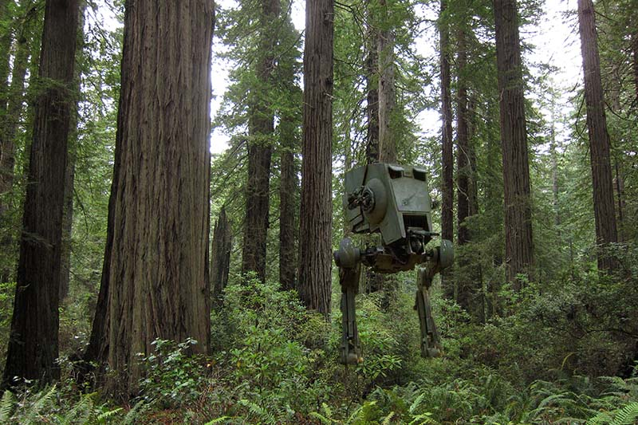
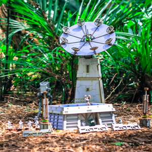

```{r setup, include=FALSE}
knitr::opts_chunk$set(echo=TRUE, error=F, warning=F)
htmltools::tagList(rmarkdown::html_dependency_font_awesome())
```


# Data exploration {-} 

# | dplyr
<hr>

{width="128" align="left" style="margin-right: 32px; margin-top: 8px; margin-bottom: 20px;"}

<br>

_You've unlocked a new package!_  

<br>

<div style="clear: both; margin-top: 22px;"></div>

The _dplyr_ package is the go-to tool for exploring, re-arranging, and summarizing data.  

Use `install.packages("dplyr")` to add _dplyr_ to your library.  


## Get to know your data frame {-}

Use these simple functions to describe your data.

### Data frame info {-}

| Function | Information             |  
|:------|:---------------------------|  
| `names(scrap)`  | column names            |  
| `nrow(...)`     | number of rows          |  
| `ncol(...)`     | number of columns       | 
| `summary(...)`  | summary of all column values (ex. _max_, _mean_, _median_)  | 
| `glimpse(...)`  | column names + a glimpse of first values (requires _dplyr_ package)   |  


# | `glimpse()` and `summary()`
<hr>

Use the `glimpse()` function to find out what type and how much data you have.

Use the `summary()` function to get a quick report on your numeric data.

### Let's read our data into R and try some of these functions. {-}

```{r glimpse, warning = F, message = F}
library(dplyr)
library(readr)

scrap <- read_csv("https://itep-r.netlify.com/data/starwars_scrap_jakku.csv")

# View your whole dataframe and the types of data it contains
glimpse(scrap)
```

```{r summary-scrap, warning = F, message = F}
# Use the summary function to get a quick of idea of means and maxima for your numeric data
summary(scrap)
```

```{r summary-try, eval=F}

# Try the rest on your own, I dare you!

nrow()

ncol()

names()

```

<br>


__Your new analysis toolbox__  

<div class="notes">

| Function      | Job                                                 |  
|:--------------|:----------------------------------------------------|  
| `select()`    | Select individual columns to drop, keep, or reorder |  
| `arrange()`   | Reorder or sort rows by value of a column           |  
| `filter()`    | Pick a subset of rows by the value of a column      | 
| `mutate()`    | Add new columns or update existing columns          | 
| `summarize()` | Calculate a single summary for the entire table     |   
| `group_by()`  | Split data into groups by values in a column        |  

</div>


# | Porg tables 

A group of porgs _(a poggle)_ will help to demo the `dplyr` functions. Follow along by downloading the __porg__ data from the URL below.

```{r, eval = F}
library(readr)
porgs <- read_csv("https://itep-r.netlify.com/data/porg_data.csv")
```

<br>

```{r porg-tabs, results='asis', echo=F}
cat(readLines("porg_tabs.txt"))
```

# | `select()`
<hr>

Use the `select()` function to:

- Drop a column you no longer need
- Pull-out a few columns to create a new table
- Rearrange or change the order of columns


## Drop columns with a minus sign: `-column_name` {-}
```{r select, warning = F, message = F}
library(dplyr)
library(readr)

scrap <- read_csv("https://itep-r.netlify.com/data/starwars_scrap_jakku.csv")

# Drop the destination column
select(scrap, -destination)
```


## Drop multiple columns with `-c(col_1, col_2)` or `-col1, -col2` {-}
```{r arrange2, warning = F, message = F}

# Drop the destination and units columns
select(scrap, -c(destination, units, amount))
```


## Keep only three columns {-}
```{r arrange3, warning = F, message = F}

# Keep the item, amount and price_per_pound columns
select(scrap, c(item, amount, price_per_pound))
```


## `everything()` {-}

`select()` also works to change the order of columns. The code below puts the `item` column first and then moves the `units` and `amount` columns directly after `item`. We then keep `evertyhing()` else the same. 

```{r arrange4, warning = F, message = F}

# Make the `item`, `units`, and `amount` columns the first three columns
# Leave `everything()` else in the same order
select(scrap, item, units, amount, everything())
```


# | `arrange()` 
<hr>

That's helpful, but Rey wants to know what the highest priced item items are. Use `arrange()` to find the origin city with the most highest priced scrap item.

```{r select-arrange, warning = F}
# Find the least expensive scrap items
scrap <- arrange(scrap, price_per_pound)

# View the top 6 rows using head()
head(scrap)
```


<br>

#### Well shucks, only `145 credits`. That's not a very impressive price at all. {-}


## Big things first: `desc()`  {-}

To arrange a column in descending order with the biggest numbers on top, we use: `desc(price_per_pound)`

```{r descend, warning = F}
# Put most expensive items on top
scrap <- arrange(scrap, desc(price_per_pound))

# View the top 6 rows
head(scrap)
```


<br>

<div class="data">
### <i class="fa fa-cogs" aria-hidden="true" style="color: green"></i> Exercise {-}

Try arranging by more than one column, such as `price_per_pound` and `amount`. What happens?

__HINT:__ You can view the entire table by clicking on it in the upper-right _Environment_ tab.
</div>

<br>

### <i class="fas fa-user-astronaut" aria-hidden="true" style="color:#040707;"></i> Pro-tip! {-}
<div class="well">

When you save an arranged data table it maintains its order. This is perfect for sending people a quick __Top 10__ list of pollutants or sites.

</div>

<br>

### Need a refreshing break? How about a... {-}

<br>


{width="300"}

<br>

# Let's play R BINGO!

{width="350" align="center" style="margin-top: 0px; margin-bottom: 4px;"}

1. No free spaces! We are mean.
1. You will soon know all of these functions.
1. We are going to call-out these functions using an R function.

```{r bingo, eval=F}
# Get pretty colors
install.packages("viridis")
library(viridis)
library(ggplot2)

# List of all the functions
bingo_words <- c("median()", "nrow()", "glimpse()", "sum()", "head()", "tail()", "arrange()", "write_csv()", "geom_col()", "filter()", "ncol()", "sd()", "summarise()", "quantile()", "install.packages()", "geom_point()", "unique()", "select()", "mean()", "min()", "left_join()", "read_csv()", "nth()", "ggplot()", "library()", "n()")

# Shuffle the words randomly
bingo_words <- sample(bingo_words)

# Set the number to draw
n <- 20

# Plot the word
ggplot(data_frame(x = 1,y = 1), aes(x = 1, y = 1)) + 
      geom_point(color = sample(viridis_pal()(30), 1), size = 177) + 
      geom_label(label = bingo_words[n], size = 12) +
      labs(x = NULL, y = NULL) +
      theme_void()
```


# | `filter()`
<hr>

The `filter()` function creates a subset of the data based on the value of one or more columns. Let's take a look at the records with the origin `"All"`.

```{r filter12, eval=T}
filter(scrap, origin == "All")
```


<br>

### <i class="fas fa-user-astronaut" aria-hidden="true" style="color:#040707;"></i> Pro-tip! {-}
<div class="data">

We use a `==` (double equals sign) for comparing values. A `==` makes the comparison "is it equal to?" and returns a True or False answer. So the code above returns all the rows where the condition `origin == "All"` is TRUE.

A single equals sign `=` is used within functions to set options, for example `read_csv(file = "starwars_scrap_jakku.csv")`. Don't worry too much. If you use the wrong symbol R is often helpful and will let you know which one is needed.

</div>

## Comparisons
<hr>

Processing data requires many types of filtering. You'll want to know how to select observations in your table by making various comparisons.

__Key comparison operators__

| Symbol| Comparison               |
|:------|:-------------------------|
| `>`   | greater than             |
| `>=`  | greater than or equal to |
| `<`   | less than                |
| `<=`  | less than or equal to    |
| `==`  | equal to                 |
| `!=`  | NOT equal to             |
| `%in%`| value is in a list       |

<br>

### Dropping rows {-}

Let's look at the data without that pesky _All_ category. Look in the table above to find the `NOT` operator. We're going to filter the data to keep only the origins that are `NOT equal to` "All".

<br>

```{r filter-all}
scrap <- filter(scrap, origin != "All")
```


<br>

We can arrange the data in descending order by `amount` to confirm that the "All" category is gone.

```{r filter-arrange, message=F, warning=F}

# Arrange data
scrap <- arrange(scrap, desc(amount))

#Look at the first 6 rows of the data
head(scrap)

```

<br>

Now let's take another look at that bar chart. Is there anything else that is less than perfect with our data?

```{r ggplot-noAll}
library(ggplot2)

ggplot(scrap, aes(x = origin, y = amount)) + geom_col()
``` 


Something still might be hidden in the data that is unexpected. Take a look at the amount of items in each units category.

```{r ggplot-Units}
ggplot(scrap, aes(x = units, y = amount)) + geom_col()
```

<br>

Interesting. The item "tons" is written two ways. This can happen when multiple labs collect data. Let's make a note to deal with this a bit later. 


## Multiple filters 
<hr>

We can add multiple comparisons to `filter()` to further restrict the data we pull from a larger data set. Only the records that pass the conditions of all the comparisons will be pulled into the new data frame. 

The code below filters the data to only scrap records originating in the `Outskirts` __AND__ destined for `Niima Outpost`.

```{r filter-multi, eval=F}

outskirts_to_niima <- filter(scrap, 
                             origin        == "Outskirts", 
                             destination   == "Niima Outpost")
```


<br>

Let's calculate some new columns to help prioritize Rey's scavenging work.


# | `mutate()`
<hr>

`mutate() `can edit existing columns in a data frame or add new columns calculated from the existing data.

## Add a column {-}
<hr>

First let's add a column with our names. That way Rey can thank us personally when her ship is up and running. 
```{r mutate-1, warning=F, message=F}

## Add your name as a column
scrap <- mutate(scrap, scrap_finder = "BB8")

```


## Add several columns {-}

We are environmental quality technical staff for the Rebellion, and there are a few types of information we routinely add to our data. Let's add new columns to document the data measurement method and the averaging time.

```{r mutate2columns, echo=T, eval=T}

#  Add your name as a column and
#  some information about your sampling method
scrap <- mutate(scrap, 
                scrap_finder    = "BB8",
                measure_method  = "REM",
                averaging_time  = "24 hours")

## REM = Rebellion Equivalent Method
```


## Change a column  {-}
<hr>

Remember how that unit of Tons was written two ways: "TONS" and "Tons"? We can use `mutate()` together with `tolower()` to make sure all of the scrap units are written in lower case. Case matters in R!

```{r mutate-2000}

# Set units to all lower-case
scrap <- mutate(scrap, units = tolower(units))

# toupper() will change all of the letters in a column to upper-case.
```


## Add calculated columns {-}

In our work we often use `mutate` to calculate new units for measurements. In this case, let's estimate the total pounds for the scrap items that are reported in tons. 


### Tons `-->` Pounds conversion {-}

Use `mutate()` to convert the `amount` column to pounds.

```{r, message=F, warning=F}

scrap_pounds <- mutate(scrap, 
                       amount_lbs = amount * 2000)
```

<br>

# | Last steps!

Rey needs an `Ion engine`. Filter the data to only that item.

```{r filter-ion, warning=F, message=F}

## Pull-out only items named `Ion engine`
scrap_pounds <- mutate(scrap_pounds, item = "Ion engine")

```


Arrange the data in descending order of pounds so Rey knows where the highest amount of scrap comes from. Then she can go there, trade for some discounted parts and __we're free to FLY TO ENDOR!__

```{r arrange-final, eval=F, message=F, warning=F}

# Arrange data
scrap_pounds <- arrange(scrap_pounds, desc(amount_lbs))

# Return the origin of the highest weight amount of scrap
head(scrap_pounds, 1)

```


<div class="quiz">

### Pop Quiz, hotshot! {-}

__For the item `Ion engine`, which origin had the most ?__

<input type="radio"> _Tuanul_              <br> 
<input type="radio"> _Cratertown_          <br> 
<input type="radio"> _Outskirts_           <br> 
<input type="radio"> _Reestki_             <br> 

<br>

<details>
<summary class = "btn_code">_Show solution_</summary>

<p>
<i class="fa fa-check" aria-hidden="true" style="color: green;"></i> `Tuanul`  

_Yes!! You receive the ship parts to repair Rey's Millennium Falcon. Onward!_

</p>
</details></div>

<div style="clear: both;"> </div>


## First mission complete!

# | Save new data

You can't break your original dataset if you always name it something else. Let's use the `readr` package to save our new CSV with the tons converted to pounds.

```{r write-csv1, eval=F}

# Save data as a CSV file 
write_csv(scrap_pounds, "scrap_in_pounds.csv")

# Save data as a CSV file to results folder
#write_csv(scrap_pounds, "results/scrap_in_pounds.csv")

```


<br>

### Time to get off this dusty planet, we're flying to Endor! {-}

{width="500" style="margin-left: auto; margin-right: auto; margin-top: 18px; margin-bottom: 12px;"}

<br>


## BB8 has a new mission {-}

BB8 received data suggesting there was a large magnetic storm right before Site 1 was burned down on Endor. Sounds a bit fishy to me.

#### We're going to be STORM CHASERS! {-}


__Get the dataset__

While we're relaxing and flying to Endor let's get set up with our new data.

<a href="https://itep-r.netlify.com/data/air_endor.csv">
<span class="btn_code_blue" style="margin-bottom: 10px;"> __DOWNLOAD__  </span></a> -  Endor Air data

1. Download the data above.
1. Create a folder in your project folder called "data".
1. Move the Endor data to this folder.
1. Create a new R script called `endor_air.R`
1. Read in the data from the data folder.

```{r, endor-air-read, eval=F}
library(readr)
library(dplyr)

air_endor <- read_csv("data/air_endor.csv")
```

```{r, endor-air-read2, include = F}
library(readr)
library(dplyr)

air_endor <- read_csv("https://itep-r.netlify.com/data/air_endor.csv")
```


# | Welcome to Endor! 

{align="center" style="width: 62%; margin-top: -4px;"}


__Let's get acquainted with the new data set.__ Remember the different ways?

Hint: `summary()`, `glimpse()`, `nrow()`

<br>


```{r, endor-air2}

glimpse(air_endor)
```

<br>

__I see that there are more analytes than we need. We only want to know about `magnetic_field` data. Let's filter the data down to only that analyte.__ 

<br>

```{r, endor-air-filter}

mag_endor <- filter(air_endor, Analyte == "magnetic_field")
```

<br>

> __Boom!__ How many rows are left now?

<br>

{width="150" align="left" style="margin-right: 32px; margin-top: 14px; margin-bottom: 20px;"}

<div style="margin-top: 44px;"></div>

When you have this type of time series data it's helpful for R to know which column is the __date__ column. Dates come in many formats and the preferred format in R is `2019-01-15`. We can use the `lubridate` package to help modify and format dates.

<div style="clear: both;"></div>

Install the `lubridate` package and use the `mdy()` function to turn the `Start_Run_Date` column into a nicely formatted date.

```{r endor-air-mutate, message=F}
library(lubridate)

mag_endor <- mutate(mag_endor, date = mdy(Start_Run_Date))
```


<br>

__We're also only interested in observations from after the year `9916`. So let's filter the data down to only dates after that year.__ 

<br>

```{r endor-air-filter-year}
mag_endor <- filter(air_endor, Analyte == "magnetic_field")

mag_endor <- mutate(mag_endor, date = mdy(Start_Run_Date))

mag_endor <- filter(mag_endor, year(date) > "9916")
```


# | Time series
```{r endor-time, message=F}
ggplot(mag_endor, aes(x = date, y = Result)) + 
  geom_line(color = "tomato", size = 2) + 
  geom_point(alpha = 0.5, size = 5) 

```


# | Calendar plots

{align="left" style="width: 23%; margin-top: 6px; margin-right: 34px; margin-bottom: 10px;"}

Calendar plots are good for zooming-in to see specific days when elevated observations may have occurred. Maybe we can pinpoint what day that magnetic storm occurred.

## `openair` package {-}

There is a calendar plot function built into a package called `openair`. Let's install `openair` and then use `calendarplot()` to make a calendar of the observations.


```{r, set-theme, echo=F, eval=F}
library(ggplot2)
theme_set(theme_grey(base_size = 35)) 
```
 
 
<br>

```{r, eval=F}
install.packages("openair") 
```

<br>

```{r, message=F, warning=F, fig.width=30, fig.height=10}
library(openair) 

calendarPlot(mag_endor, 
             pollutant    = "Result", 
             statistic    = "mean", 
             year         = 9917, 
             annotate     = "date",
             digits       = 0, 
             key.footer   = "nT", 
             par.settings = list(fontsize       = list(text = 34), 
                                 layout.heights = list(top.padding = 1)),
             main = "Magnetic Field Strength at Endor Battle Site 1")

```


### Mission accomplished! {-}

It looks like there really were high magnetic field readings in November of Galactic year 9917. With luck, the Resistance will reward us handsomely for this information.

<br>

# | Operation Shut Down

When you close R for the first time you will see some options about saving your workspace and other files. In general, we advise against saving these files. It's easy enough to re-run your script next time you open your project. This will help RStudio open a fresh and clean environment every time you start it.

Follow these steps to set these options permanently.

__Turn off “Save Workspace”__

1. Go to ` Tools > Global Options.... `  on the top RStudio navigation bar
1. On the first screen:
    - [ ] Uncheck Restore .Rdata into workspace at startup
    - Set _Save workspace to .RData on exit_ to ["Never”].
    - [ ] Uncheck Always save history

### <i class="fa fa-rocket" aria-hidden="true"></i> Return to [Homebase](../post/day-1.html) {-}

<br>

