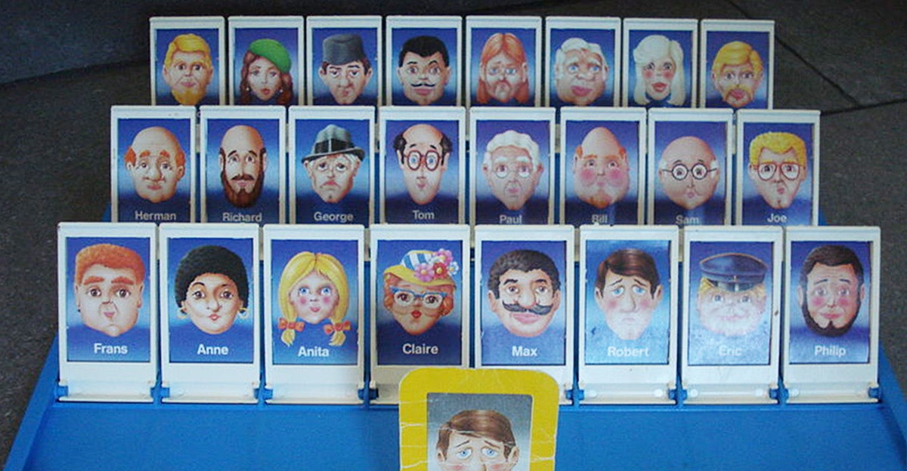

```{r setup, include=FALSE}
knitr::opts_chunk$set(echo = TRUE, warning = F, message = F)
knitr::opts_chunk$set(fig.width = 10, fig.height = 5.2) 
htmltools::tagList(rmarkdown::html_dependency_font_awesome())
```

<br>

# Guess Who! _Star Wars edition_ {-}
<br>

{width="350" align="right" style="margin-top: -20px; margin-left: 20px; margin-right: 36px;"}

> Are you the best Jedi detective out there? Let's play a game to find out. In the past day and a half, we have learned a lot of the `dplyr` functions. Guess what else comes with the `dplyr` package? A **Star Wars data set**!

<br>

Open the data set now by completing the following steps:

1. First, load the `dplyr` package from your `library()`
1. Second, pull the Star Wars dataset into your environment.
    - I'm very literal so I named the data: **starwars_guess_who**
<br><br>
```{r, echo = T, eval = T}

library(dplyr)

starwars_guess_who <- starwars
```

<br>

### <span style="text-decoration: underline;"> Rules </span> {-}

1. Scroll through the Star Wars dataset and find a character you find interesting.
   - Or run `sample_n(starwars, 1)` to choose your character at random.
1. __Keep it hidden!__ Don't show your neighbor the character you chose.
1. Take turns asking each other questions about your neighbor's Star Wars character. 
1. Use the answers to build a `filter()` function and narrow down the potential character your neighbor may have picked. 
1. _Elusive_ answers are encouraged.
    - For example, if someone asks: _What is your character's mass?_ 
    - You can respond: _My character's mass is equal to one less than their age._ 
    - If you're feeling generous you can give a more straight forward answer such as: _My character's mass is definitely more than 100 and less that 140._
1. Sometimes a character will not have a specific attribute. We learned earlier how R stores nulls as `NA`. So, some of your filter statements might be `is.na(hair_color)` or `is.na(mass)`. 

<span style="margin-top: 18px; color: green;"> __WINNER!__ </span>

- The winner is the first to guess their neighbor's character.

<br>

Here's a `filter()` statement to subset the data to the character _Plo Koon_.

```{r, eval = F}
mr_koon <- filter(starwars,
                  mass       < 100,
                  eye_color  != "blue",
                  gender     == "male",
                  homeworld  == "Dorin",
                  birth_year > 20)

```

<br>

<details>
<summary class = "btn_code_green"> __WINNERS Click here for cuteness!__ </summary>

<div class="data">
<p>


</p></div>
</details>


<br>

<div class="data">

#### Want a rematch? {-}

How about we make it best of __3__ games.

</div>


<br>

# | `ifelse()`

### `[If this thing is true]`, `"Do this"`, `"Otherwise do this"` {-}

<br>

Here's a handy `ifelse` statement to help you identify lightsabers.

{style="width: 40%; margin-top: -8px; margin-bottom: 12px;" align="center"}

<div class="well">
`ifelse( `__Is lightsaber__ <span style="color: green;">__GREEN__?</span>, __Yes!__`Then it's Yoda's,` __No!__`Then it's not Yoda's)`

</div>


Sometimes you'll want the value of a new column to depend on the value of an existing column. In other words you want the new value to depend on a condition. We use `ifelse()` to do this.

When you have measurements in both PPB and PPM you may only want to convert the "PPM" measurements. Or if you have expensive and inexpensive ion engines you may only want to flag those that cost less than 500 credits. In both cases `ifelse` is the tool for you.

## `mutate()` + `ifelse()` is powerful! {-}

{style="width: 65%;" align="center"}

<br>

### Units update {-}

Let's use `ifelse` to update the units column to all be written as "Tons".

```{r ifelse, message=F, warning=F}

library(dplyr)
library(readr)

# Get the data
scrap <- read_csv("https://itep-r.netlify.com/data/starwars_scrap_jakku.csv")

# Convert the TONS in all capital letters to title case "Tons"
# On Day 1 we did this using tolower()

scrap <- scrap %>% 
         mutate(units = ifelse(units == "TONS", "Tons", units))

```

<br>

### Calibration error {-}

{align="left" style="width: 44%; margin-top: 18px; margin-right: 24px;"}

We just received news that __Cratertown's__ scale was rigged. It was miscalibrated to overestimate the tons of outgoing scrap. Smart! But that means we have some junk data mixed in with our scrap data. Let's use `ifelse` to reduce the tonnage by `10%`, but only for the scrap from `Cratertown`.

<br>

<div style="clear: both;"></div>

```{r calibrate, eval=T}
# Reduce the amount of scrap from Cratertown by 10%
## Multiply the column "amount" * 0.90 
## Use ifelse() to only select rows where the origin == "Cratertown"
scrap <- scrap %>% 
         mutate(amount = ifelse(origin == "Cratertown", amount * 0.90, amount))

```

<br>

<div class="data" style="clear: both;">
__Congratulations__ of galactic proportions to you. We have a clean and tidy data set. If BB8 receives new data to append, we can re-run this script and in 5 seconds we will have a cleaned up data set again!
</div>

<br>


{align="right" style="width: 50%; margin-left: 20px; margin-right: 12px; margin-top: 40px;"}

<br><br>

### Plot the data! {-}   
### Plot the data! {-}  
### Plot the data! {-}  

<br>

<div style="clear: both;"></div>


# | Plots with _ggplot2_
<hr>

<br>

{align="right" width="145" style="margin-right: 70px; margin-top: -28px;"}


## The `ggplot()` sandwich {-}


{style="margin-top: -22px; max-width: 108%;"}

<span class="h6" style="font-size: 28px; font-weight: bold;"> The 3 ingredients in a `ggplot` </span>


### 1. The base plot {-}
```{r, echo = T, eval = T}
library(ggplot2)
```


```{r, echo = F}
library(dplyr)
library(readr)

# Read in the conversion data
convert_url <- "https://itep-r.netlify.com/data/conversion_table.csv"

convert <- read_csv(convert_url)

# Read in scrap data
scrap <- read_csv("https://itep-r.netlify.com/data/starwars_scrap_jakku_full.csv")

# Join the scrap to the conversion table
scrap <- left_join(scrap, convert)

# Calculate the number of credits
scrap <- scrap %>% 
         mutate(credits = amount * pounds * price_per_pound)

```

```{r, echo = T, eval = T}
ggplot(scrap)
```

<br>

> Note when we load the package it's `library ("ggplot2")`, but the function to make a plot is `ggplot(scrap)`. We admit, it is a bit silly.


### 2. The the X, Y _aesthetics_  {-}

The _aesthetics_ assign the components from the data that you want to use in the chart. These also determine the dimensions of the plot.

```{r, eval = T}
ggplot(scrap, aes(x = destination, y = credits)) 
```


### 3. The layers or _geometries_  {-}
```{r, eval = T}
ggplot(scrap, aes(x = destination, y = credits)) + geom_point()
```

<br>


#### <i class="fa fa-cogs" aria-hidden="true" style="color: green"></i> Exercise {-}

Try making a scatterplot of any two columns.

_Hint: Numeric variables will be more informative._

```{r, eval = F, echo = T}
ggplot(scrap, aes(x = __column1__, y = __column2__)) + geom_point()
```

## Colors {-}
<hr>


Now let's use color to show the origins of the scrap
```{r, eval = T}
ggplot(scrap, aes(x = destination, y = credits, color = origin)) +
  geom_point()
```


<br>

This is a **A LOT** of detail. Let's make a bar chart and add up the sales to make it easier to understand.

```{r, eval = T}
ggplot(scrap, aes(x = destination, y = credits, fill = origin)) + geom_bar(stat = "sum")
```

<br>

This is the same as `geom_col()`.
```{r, eval = T}
ggplot(scrap, aes(x = destination, y = credits, fill = origin)) + geom_col()
```

<br>

<div class="data">
#### It's still a bit tricky to compare sales by origin. Let's change the position of the columns. {-}
</div>

```{r, eval = T}
ggplot(scrap, aes(x = destination, y = credits, fill = origin)) +
  geom_bar(stat = "sum", position = "dodge")
```


# Homeworld training {-}

{style="float: right; margin-top: -10px;"}

1. Load one of the data sets below into R
    - Porg contamination on Ahch-To: "https://itep-r.netlify.com/data/porg_samples.csv"
    - Planet Endor air samples: "https://itep-r.netlify.com/data/air_endor.csv"
    - Or use data from a recent project of yours  

<br>
  
2. Create 2 plots using the data. 
3. _Don't worry if it looks_ __really weird__. _Consider it art and try again._  


### <i class="fa fa-user-astronaut" aria-hidden="true" style="color:#040707;"></i> Pro-tip! {-}

<div class="note">

When you add more layers using `+` remember to place it at the end of each line.

```{r, eval = F, echo = T}
# This will work
ggplot(scrap, aes(x = origin, y = credits)) +
  geom_point()

# So will this
ggplot(scrap, aes(x = origin, y = credits)) + geom_point()

# But this won't
ggplot(scrap, aes(x = origin, y = credits))
  + geom_point()

```

</div>


# | More Plots

## Colors {-}
<hr>

Now let's use color to show the destinations of the scrap.


```{r, eval=T, echo = T}
ggplot(scrap, aes(x = origin, y = credits, color = destination)) +
  geom_point()
```

<br>

### <i class="fa fa-user-astronaut" aria-hidden="true" style="color:#040707;"></i> Pro-tip! {-}
<div class="well">

An easy way to experiment with colors is to add layers like `scale_fill_brewer` or `scale_colour_brewer` to your plot which will link to RcolorBrewer palettes so you can have accessible color schemes.

</div>

## Bar charts {-}

This is a too much detail. Let's make a bar chart and add up the sales to make it easier to understand. Note that we use `fill=` inside `aes()` instead of `color=`. If we use color, we get a colorful outline and grey (or gray) bars.


```{r, eval = T, echo = T}
ggplot(scrap, aes(x = origin, y = credits, fill = destination)) +
  geom_col()
```

<br>

Let's change the position of the bars to make it easier to compare sales by destination for each origin? Remember, you can use `help(geom_col)` to learn about the different options for that plot. Feel free to do the same with other `geom_`'s as well.


```{r, eval = T, echo = T}
ggplot(scrap, aes(x = origin, y = credits, fill = destination)) +
  geom_col(position = "dodge")
```


## Facet wrap {-}

Does the chart feel crowded to you? Let's use the `facet wrap` function to put each origin on a separate chart.

```{r, eval = T, echo = T}
ggplot(scrap, aes(x = origin, y = credits, fill = destination)) +
  geom_col(position = "dodge") +
  facet_wrap("destination")
```


## Themes {-}

You may not like the appearance of these plots. `ggplot2` uses `theme` functions to change the appearance of a plot. Try some different themes out.

```{r, eval = T, echo = T}
ggplot(scrap, aes(x = origin, y = credits, fill = destination)) +
  geom_col(position = "dodge") +
  facet_wrap("destination") +
  theme_bw()
```


## Labels {-}

You can also change the axis and title labels using the `labs` function.

```{r, eval = T, echo = T}
ggplot(scrap, aes(x = origin, y = credits, fill = destination)) +
  geom_col(position = "dodge") +
  facet_wrap("destination") +
  theme_bw() +
  labs(title = "Scrap sales by origin and destination", 
       x     = "Origin", 
       y     = "Total sales")
```

<br>

## Drop `2.2e+06` scientific notation {-}

Want to get rid of that ugly scientific notation? We can use `options(scipen = 999)`. Note that this is a general setting in R and not part of `ggplot`. Once you use `options(scipen = 999)` in your current session, you don't have to use it again (like loading a package, you only need to run the line once when you start a new R session).

<br>

```{r, eval = T, echo = T}
options(scipen = 999)

ggplot(scrap, aes(x = origin, y = credits, fill = destination)) +
  geom_col(position = "dodge") +
  facet_wrap("destination") +
  theme_bw() +
  labs(title = "Scrap sales by origin and destination", 
       x     = "Origin", 
       y     = "Total sales")
```

<br>

<div class="note">
#### CHALLENGE {-}

Let's say we don't like printing so many zeros and want the labels to be in __Millions__ of credits. Any ideas on how to make that happen?
</div>


<br>


### <i class="fa fa-cogs" aria-hidden="true" style="color: green"></i> Exercise {-}

<div class="data">

#### Your turn! {-}
 
Be brave and make a boxplot. We've covered how to do a scatterplot with `geom_point` and a bar chart with `geom_col`, but how would you make a boxplot showing the prices at each destination? You're on your own here. Feel free to add `color` ,`facet_wrap`, `theme`, and `labs` to your boxplots. 

May the force be with you.

</div>

## Save plots {-}

You've hopefully made some plots you're proud of, so let's learn to save them so we can cherish them forever. There's a function called `ggsave` to do just that. How do we `ggsave` our plots? HELP! Let's type `help(ggsave)`.

```{r ggsave, eval = F, echo = T}
# Get help
help(ggsave)
?ggsave

# Copy and paste the r code of your favorite plot here
ggplot(data, aes()) +
   .... +
   ....


# Save your plot to a png file of your choosing
ggsave("your_results_folder/plot_name.png")
```


<br>


### <i class="fa fa-user-astronaut" aria-hidden="true" style="color:#040707;"></i> Pro-tip! {-}
<div class="note">

Sometimes you may want to make a plot and save it for later. For that, you give your plot a name. Any name will do.

```{r ggsave-objects, eval = F, echo = T}

# The ggplot you want to save
my_plot <- ggplot(...)
  
# The name of the file the chart will be saved to.
where_to_save_it <- "___.png"

# Save it!
ggsave(filename = where_to_save_it, plot = my_plot)
```

</div>

_Learn more about saving plots:_ [http://stat545.com/](http://stat545.com/block017_write-figure-to-file.html)


# | Glossary

__Table of `aesthetics`__

| aes()         |    
|:--------------|  
| `x = `        |     
| `y = `        |      
| `alpha = `    |     
| `fill = `     |      
| `color = `    |    
| `size = `     |     
| `linetype = ` |      


<br>

__Table of `geoms`__


<br>

__Table of `themes`__

You can customize the look of your plot by adding a `theme()` function.


# Plot Questions {-}

<div style="font-size: 16px;">

- How to modify the gridlines behind your chart?
    - Try the different themes at the end of this lesson: `theme_light()` or `theme_bw()`
    - Or modify the color and size with `theme(panel.grid.minor = element_line(colour = "white", size = 0.5))`
    - There's even `theme_excel()`
- How do you set the x and y scale manually?
    - Here is an example with a scatter plot: `ggplot() + geom_point() + xlim(beginning, end) + ylim(beginning, end)`
    - __Warning:__ Values above or below the limits you set will not be shown. This is another great way to lie with data. 
- How do you get rid of the legend if you don't need it?
    - `geom_point(aes(color = facility_name), show.legend = FALSE)`
    - The [R Cookbook](http://www.cookbook-r.com/Graphs/Legends_(ggplot2)/) shows a number of ways to get rid of legends.
- I only like dashed lines. How do you change the linetype to a _dashed_ line? 
    - `geom_line(aes(color = facility_name), linetype = "dashed")`
    - You can also try `"dotted"` and `"dotdash"`, or even`"twodash"`
  
- How many colors are there in R? How does R know `hotpink` is a color?
    - There is an [R color cheatsheet](https://www.nceas.ucsb.edu/~frazier/RSpatialGuides/colorPaletteCheatsheet.pdf)  
    - As well as a list of [R color names](http://www.r-graph-gallery.com/42-colors-names/)
    - `library(viridis)` provides some great default color palettes for charts and maps.
    - This [Color web tool](http://colorbrewer2.org/#type=sequential&scheme=BuGn&n=3) has palette ideas and color codes you can use in your plots
- Keyboard shortcuts for RStudio
    - There is a [Shortcut cheatsheet](https://www.rstudio.com/wp-content/uploads/2016/01/rstudio-IDE-cheatsheet.pdf)
    - In RStudio you can go to _Help_ > _Keyboard Shortcuts Help_

</div>

<br>


### <i class="fa fa-rocket" aria-hidden="true"></i> Return to [Homebase](../post/day-2.html) {-}
