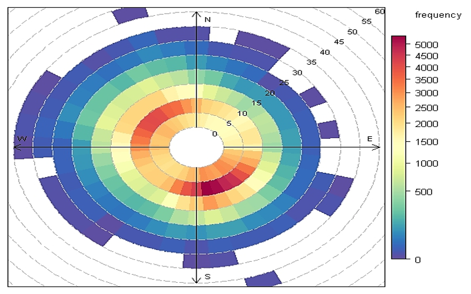
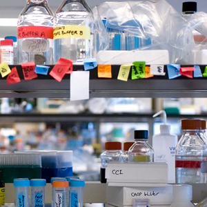

```{r setup, include=FALSE}
knitr::opts_chunk$set(echo = TRUE, warning = F, message = F)
knitr::opts_chunk$set(fig.width = 10, fig.height = 5.2) 
htmltools::tagList(rmarkdown::html_dependency_font_awesome())
```

# Create a GitHub account

It's time to share with the world. Let's go public. [Join GitHub](https://github.com/)

[](https://github.com/)


## Add a new repository

Now we can create a new `repository` to store some of our new R plots and scripts. Click the bright green `New` button to get started.


- Give it a short name like `Rplots`
- Keep it public
- [x] Check the box to initialize with a README 
- Click `[ Create repository ]`

## Add a plot

Click `Upload files` to add an image of an R plot or one of your scripts as an `.R` file.


# Day 1 review


# Day 2 review


### `ggplot` {-}


# On Earth

Now that we're back on Earth, let's look at some data to get reacclimated. Choose one of the data exercises below to begin. 


<div class="row3" style="margin-top: 20px;">

<div class="column3"><div align="center" style="margin-left: -18px;">
<a href="explore_wind_rose.html"> __Air and Wind__ </a>
</div></div> 

<div class="column3"> <div align="center">
<a href="explore_GIS_maps.html" style="margin-left: auto;"> __Maps for humans__ </a></div></div> 

<div class="column3"> <div align="center">
<a href="explore_messy_emissions.html" style="margin-left: auto;"> __Tidy emissions__ </a></div></div> 


</div>


<div class="row3">

<div class="column3" style="height: 160px; max-height: 160px;">
<div class="" style="border: 0px solid grey;">
<a href="explore_wind_rose.html">
{style="width: 290px; margin-top: 14px;"}
</a>
</div></div>

<div class="column3" style="height: 160px; max-height: 160px;">
<div class="" style="border: 1px solid grey; max-height: 160px; overflow: hidden;">
<a href="explore_GIS_maps.html"></a>
</div></div>

<div class="column3" style="height: 160px; max-height: 160px;">
<div class="" style="border: 1px solid grey; max-height: 160px; overflow: hidden;">
<a href="explore_messy_emissions.html"></a>
</div></div>

</div>


<div class="row3">
<div class="column3">

Explore the connection between wind direction, wind speed, and pollution concentrations near Fond du Lac. Make a wind rose and then a `pollution rose`, two of my favorite flowers.  

</div>

<div class="column3">

Study the housing habits of Earthlings. Create interactive maps showing the spatial clustering of different social characteristics of the human species.  

</div> 

<div class="column3">

Start with messy wide data and transform into a tidy table ready for easy plotting, summarizing, and comparing. For the grand finale, read an entire folder of files into 1 table.

</div>

</div>

<div class="row3" style = "margin-top: 2px;">
<div class="column3">

Media: `air`   
Planet: `Earth`

</div>

<div class="column3">

Media: `social-human`   
Planet: `Earth`

</div>

<div class="column3">

Media: `air`   
Planet: `Earth`

</div>
</div>


<br>

