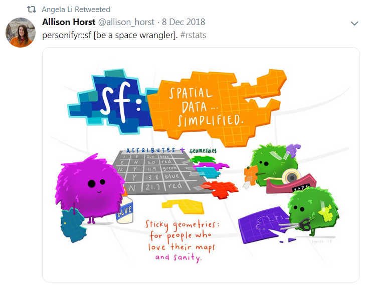
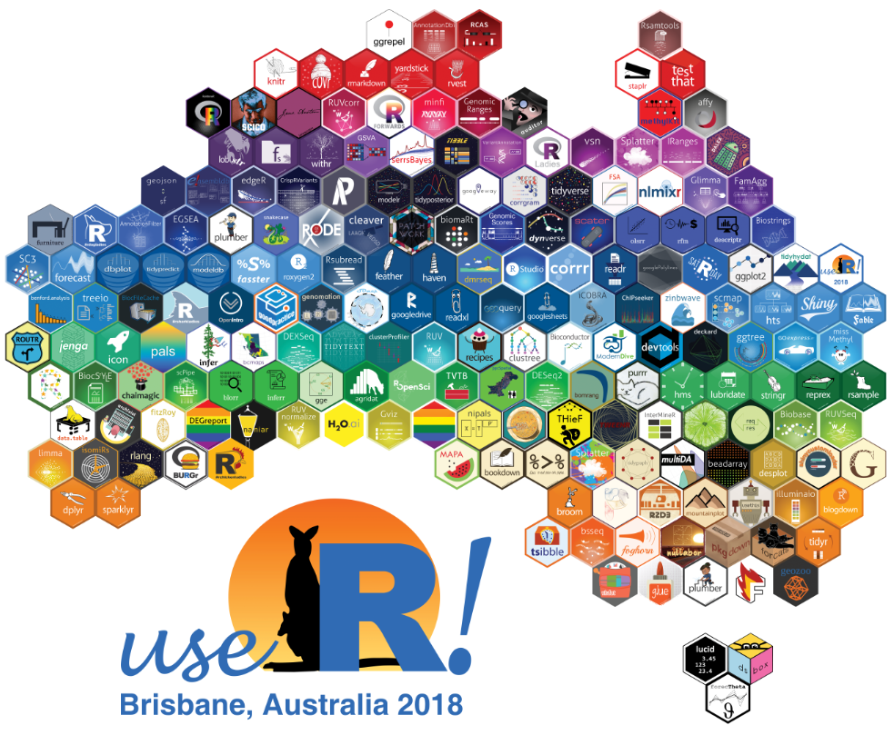

## You are not alone in the universe 

{style="width: 90%;"}

 _Growth of R groups since 2011_ 

 

__Online Communities__

{style="width: 50%; float: right; margin-left: 20px; margin-top: -26px;"}

- `#rstats` on [Twitter](https://twitter.com/search?q=%23rstats&src=typd&lang=en)
- [ROpenSci](https://ropensci.org/)
    - [Packages & Data](https://ropensci.org/packages/)
    - [Open Calls](https://ropensci.org/commcalls/)
- [RStudio's forum](https://community.rstudio.com/)
- R Ladies: https://rladies.org/
    - R Ladies Global [Twitter](https://twitter.com/rladiesglobal?lang=en)
- [R Weekly](https://rweekly.org/) shares weekly highlights from across the R world 
- R Bloggers: https://www.r-bloggers.com/

 

__Face-to-face__

- useR Conference - [2019 Toulouse, France](http://www.user2019.fr/)
    - 2018 in [Brisbane, Australia](https://user2018.r-project.org/)
- RStudio [Conferences & workshops](https://www.rstudio.com/conference/)

 
 

##
