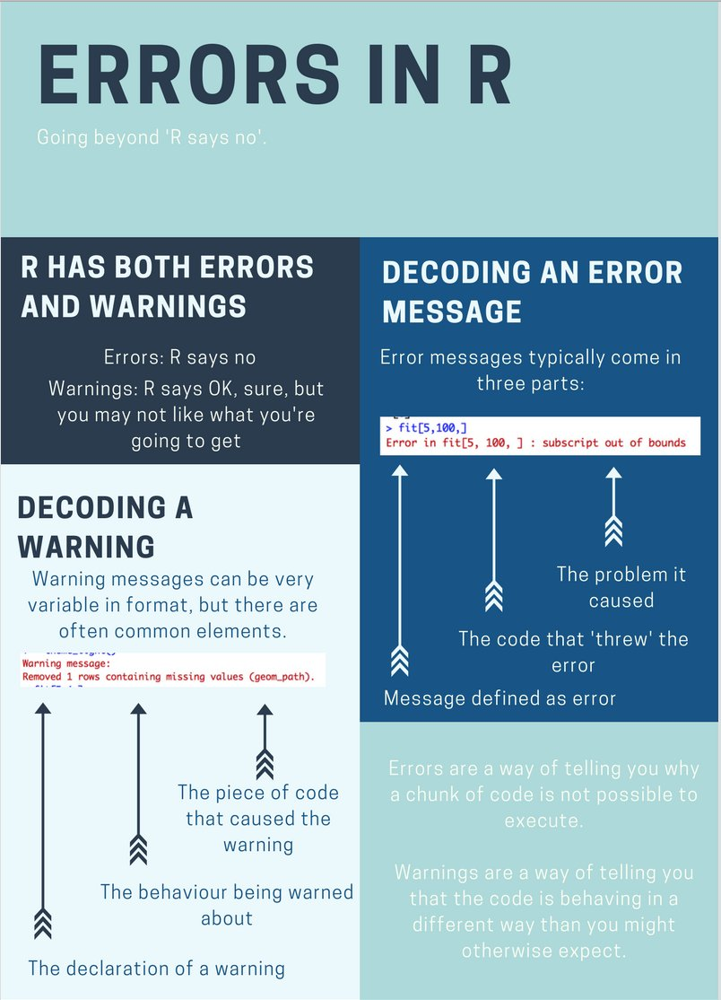

```{r setup, include=FALSE}
knitr::opts_chunk$set(echo = FALSE)
library(icon)
```

<style> code {color: #535353 !important;} </style>


__Cheatsheets__

Use __Cheatsheets__ to find common functions: 

- In RStudio go to _Help_ > _Cheatsheets_ 
    - _Data Transformation_ | Helpful functions for cleaning and arranging your data.  
    - _Data Visualization_ | Quick reference for all `ggplot`-ing options. 


__Learn more R__

- In your browser: [DataCamp Intro](https://campus.datacamp.com/courses/free-introduction-to-r/chapter-1-intro-to-basics-1?ex=1)
- RStudio lessons: https://rstudio.github.io/learnr/examples.html
- RStudio videos: https://tutorials.shinyapps.io/04-Programming-Basics/#section-welcome
-	Learn inside R:  [swirlR](https://swirlstats.com/students.html)  
- Coursera classes: [John Hopkins courses w/ Roger Peng](https://www.coursera.org/specializations/jhu-data-science)    

__Find new packages and functions__

- To search packages in R get: [CRANsearcher](https://github.com/RhoInc/CRANsearcher)

__Books__    

- [__R for Data Science__](http://r4ds.had.co.nz/): comprehensive & free book online
- R Cookbook: https://www.cookbook-r.com     
    
__Searching online__

- [google.com](www.google.com): include `r` or `rstats` + `the question`
- [stackoverflow.com](https://stackoverflow.com/questions/12675147/how-can-we-make-xkcd-style-graphs) + use the `[r]` tag


## Troubleshooting

- Get function help inside R: `?arrange()` 

Here are few things we forget to do all the time and are good first things to check for when you run into problems.
  
- Make sure all parentheses are balanced so that every opening "`(`" has a corresponding closing "`)`".
- Be sure you complete your expressions. If you think you have completed typing your code, but instead of seeing the `>` command prompt at the console you see the `+` character instead, then either R is still thinking or it is still waiting for you to complete your expression. You can hit `Esc` or `Ctrl-C` to force your way back to the console and try typing your code again. 
- In `ggplot` we build up plots a piece at a time by adding expressions to one another. When doing this, make sure the `+` character goes at the end of each line, and not the beginning. 
- R doesn't love `\` backward slashes like _Windows_, check that they didn't sneak into your expression somewhere. When in doubt use the `/` forward slash.
  

This makes `ggplot` happy:

```{r trouble_gg1, echo=TRUE, eval=FALSE}
ggplot(data = mpg, aes(x = displ, y = hwy)) +
    geom_point()
```

This makes `ggplot` sad:

```{r trouble_gg2, echo=TRUE, eval=FALSE}
ggplot(data = mpg, aes(x = displ, y = hwy))
+ geom_point()
```

<br>

## Error messages

<div align="center">
{width="450"}
</div>

_Not all error messages are as helpful or easy to interpret, but they are getting better._

<br>
