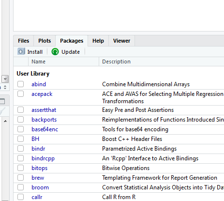

<style> code {color: #FF69B4 !important;} </style>


```{r setup, include=FALSE}
knitr::opts_chunk$set(echo = FALSE)
#<style> code {color: #535353 !important;} </style>
```

</br>

# Install `R` 

<hr>

{style="float: left; width: 41%; margin-top: 26px; margin-right: 28px; margin-bottom: 26px; margin-left: -12px;"}

The R language and its tools are built by people from around the world. Together they help you perform data analysis in an easy to follow step-by-step fashion, just like you're following a recipe for cookies. And once you find your favorite recipe, you can easily use it over again on new data or even share it with your collaborators.


<ul class="nav nav-pills" id="myTab" role="tablist" style="margin-top: 18px;">
<li class="nav-item active">
  <a class="nav-link" id="windows-tab" data-toggle="tab" href="#windows" role="tab" aria-controls="windows" aria-selected="true">Instructions for Windows </a>
</li>
<li class="nav-item">
  <a class="nav-link" id="mac-tab" data-toggle="tab" href="#mac" role="tab" aria-controls="mac" aria-selected="false">Mac/Apple</a>
</li>
<li class="nav-item">
  <a class="nav-link" id="linux-tab" data-toggle="tab" href="#linux" role="tab" aria-controls="linux" aria-selected="false">Linux</a>
</li>
</ul>

<div class="well tab-content" id="myTabContent">
  <div class="tab-pane fade active in" id="windows" role="tabpanel" aria-labelledby="windows-tab">
  
#### Windows 

1. Navigate to R's download page -> [Windows](https://cran.r-project.org/bin/windows/base/)  
1. Click `Download R 3.*.* for Windows`
    - ex. `R-3.5.*-win.exe`
1. Save the file and install with the default options.

For a __video__ walk through see [Installing R on Windows](http://youtu.be/mfGFv-iB724)

</div>

<div class="tab-pane fade" id="mac" role="tabpanel" aria-labelledby="mac-tab">

#### Mac/Apple 

1. Navigate to R's download page ->  [Mac](https://cran.r-project.org/bin/macosx/)
1. Scroll down and download the first file under _Latest release:_ 
    - ex. `R-3.5.*.pkg`
1. Save the file and install with the default options.

For a __video__ walk through see [Installing R on Mac](http://youtu.be/Icawuhf0Yqo)

</div>


<div class="tab-pane fade" id="linux" role="tabpanel" aria-labelledby="linux-tab">
 
#### Linux

1. Navigate to R's download page -> [Linux](https://cran.r-project.org/bin/linux/)
1. Choose your operating system.

</br>

</div></div>

</br>


# Install `RStudio` 
<hr>

{style="float: right; margin-top: -12px;"}

__RStudio__ is the handy user interface we use to write R scripts and keep our projects organized. It isn't required to use R, but it makes things a whole lot easier.

<div class="well" style="margin-top: 5px;">
__Install RStudio__  

1. Open your web browser and navigate to [www.rstudio.com](https://www.rstudio.com/products/rstudio/download/#download)
1. Choose your operating system and download the newest version
1. Open the file and install with the default options
1. You are officially ready to __R__

</div>
</br>


# Update `R`
<hr>

{style="float: left; width: 22%; margin-top: -6px; margin-right: 28px;"}

</br>

The R software receives periodic updates, about once a year. Windows users can update R with the `installR` package, and Mac users can use the `updateR` package. Linux users can go to the [R Archive](https://cran.r-project.org/) and follow the download links for their operating system.

</br>


<ul class="nav nav-pills" id="myTab" role="tablist" style="margin-top: 12px;">
<li class="nav-item active">
  <a class="nav-link" id="windows-tab" data-toggle="tab" href="#windows" role="tab" aria-controls="windows" aria-selected="true"> Update on Windows </a>
</li>
<li class="nav-item">
  <a class="nav-link" id="mac-tab" data-toggle="tab" href="#mac" role="tab" aria-controls="mac" aria-selected="false"> Mac/Apple </a>
</li>
</ul>

<div class="well tab-content" id="myTabContent">
  <div class="tab-pane fade active in" id="windows" role="tabpanel" aria-labelledby="windows-tab">

#### Windows 

1. Run:  `install.packages("installr")`
1. Run:  `installr::updateR()` to check for updates
    - Click **Ok** to begin installation
    - Click *No* to news
    - Click *Yes* to install
    - Click *No* to running updateR from the Rgui
    - Click *Next* and leave default options on each of the installation windows
    - Click *Finish*
1. `Yes` to copy your R packages
1. `No` to keeping a copy for the old R version
1. `No` to copying your `.Rprofile`
1. `No` to starting the Rgui
1. `No` to quitting R  
1. Save any open R scripts
1. Close and restart R
 
</div>
 
<div class="tab-pane fade" id="mac" role="tabpanel" aria-labelledby="mac-tab">

### On Mac/Apple

```{r, eval=F}
# Get the devtools package
install.packages("devtools")

# Get the updateR package
devtools::install_github("andreacirilloac/updateR")

# Update R
updateR::updateR(admin_password = "Admin user password")
```

</div></div>
  
<br>

# Update `RStudio`
<hr>

{style="float: right; margin-top: -32px; margin-left:24px; margin-right: 60px"}

You can check for __RStudio__ updates from the `Help` menu in RStudio's top navigation bar.


<div class="well" style="margin-top: 5px;">
__Instructions__  

1. Open RStudio
1. Click `Help` on the far right of the top navigation bar
1. Select `Check for Updates`
1. Follow the installation instructions

</div>

<br>

# Update your R packages
<hr>

There are two places where you can udpate R packages within R Studio.

<br>

#### 1. In the `Files and Plots` area in the bottom right, under the `Packages` tab:



<br>

#### 2. In the `Tools` tab above at the top above the Code Editor:


<br>

