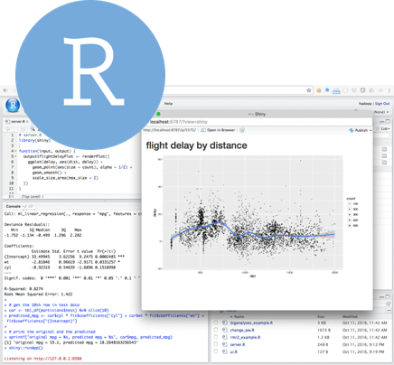

<div style="margin-top: -30px;">

## R for Environmental Data Analysis 

Fond du Lac Tribal and Community College        
2101 14th Street     
Cloquet, MN 55720  

</div>

```{r setup, include=FALSE}
knitr::opts_chunk$set(echo = FALSE)
library(icon, knitr)
```

<div style="margin-top: 12px;">

{style="max-width: 30%; margin-top: 0px; margin-left: 0; margin-right: 0;"}

</div>

# Day 1
Planets visited: `Endor and Jakku`

<div class = "row">
<div class = "col-md-6">

**Morning** | _8:30-11:45am_  

Begin Jedi training. 

1. Power on your droid
    - Install and update R
1. __Project__ launch
    - Start a new R project
    - Create an R script
1. Tour and customize __RStudio__
1. Decipher code from the _Empire_
1. Invent new/fake data
    - Variables, names, and lists oh my!
1. Make a data table / __dataframe__  
1. Upgrade your droid    
    - Add new R packages    
1. Read __real data__ into R
    - `readr` for text files
    - `readxl` for Excel files
1. Get visual with `ggplot2`
    - Plot the data, plot the data, plot the data!
    - Look for errors and outliers
    
Packages: `readr`, `ggplot2`

</div>
<div class = "col-md-6">

**Afternoon** | _1:15-5:00pm_  

1. Explore data
    - Column names, rows, observations, value types
    - Missing values
    - Mean, max, min, quantile 
1. Data transformations with `dplyr`
    - Arrange, sort, and __filter__ data 
1. Summarize data
1. Find the most profitable scrap for Rey   
1. Make a summary for each __group__, site, or category within the data 
    - Summarize by location  
    - Check for the number of data points in a group (you can use this to check for completeness!)
1. Introduction to working with dates `lubridate` 
    

    - Plot data by dates (Calendar plots)

> Help Rey get scrappy and solve a junk-data mystery
> Travel to Endor and investigate if the Wookies ever even had a chance.     

Packages: `dplyr`    

</div>
</div>


# Day 2

<div class = "row">
<div class = "col-md-6">

**Morning** | _8:30-11:45am_   
Planets visited: `Endor and Jakku`

_Questions and Review_

1. Intermediate data manipulation
    -	Join tables together
    -	Adding and calculating new columns
    - Unit conversions
    - Make new columns based on a condition
1. Learn summary functions: mean, median, max, min, nth, etc.
1. String many functions together for less typing.
1. Save files.

Packages: `tidyair`, `openair`

</div>

<div class = "col-md-6">
**Afternoon** | _1:15-5:00pm_  

> _Star Wars - Guess Who_   

1. Plot like a Jedi!
    -	Make Scatter plots and box plots 
    -	Add titles, colors, and labels 
    -	Histograms 
    -	Highlight individual points 
    -	Reference lines 
    - Add trend lines `r icon::fa("chart-line", size = 1)`
1.	Save charts to different formats 

>	**Exercise**  
> Use plots and summaries to compare two data sets

3. Plot `pollution` vs. `meteorology`
    - Scatter plots
        - Conc vs. Temp
        - Conc vs. Hour of day
        - Temp vs. Hour of day
1. More __plots__
    - Log transform
    - Reference lines
1. Time series plots with regression line and detection limits
1. Data cleaning
1. Working with difficult __data__
    - Replacing NULL values, -999 
1. Find outliers

>	**Exercise**  
> Rey to the Rescue 


Packages: `sf`, `leaflet`

</div>
</div>


# Day 3
Planets visited: `Ahch-To`

> Your turn!

<div class = "row">
<div class = "col-md-6">
**Morning** | _8:30-11:45am_  

1. Share your data and code.

__Questions / Review__

It's time to CHOOSE a side.

1. Choose your own adventure!
    -	Select your own or Star Wars data
    - Clean the data 
    -	Create a summary table
    -	Compare years
    -	Chart & map the data 
    - Multiple paths to choose from
1. **Retrieving data from the web**
    - Download NEI data from EPA
    - FTP sites
1. NEI trend charts
1. Saving plots 

- __PATHS__
    - Custom functions: 
        - **Design values**   
    - Charts for publications and reports  
    - Trend analysis
    - Site comparisons
        - Save the __porgs__
    - Messy data 
        - Read an entire folder of files and combine into 1 table
    - More maps and shapefiles
        - Read and save shapefiles
        - Convert coordinate projections (ex. `Lat/Long` to `UTM`)
        - Load reference maps (Tribal boundaries, States, Counties)
        - Build interactive maps
        - Packages: `tidycensus`, `tigris`
    - Connect to __databases__
        - View tables
        - Read data
        

</div>

<div class = "col-md-6">
**Afternoon** | _1:15-5:00pm_   

Share with the world

1. Build a report
1. Put script and results in __Rmarkdown__
1. Generate Web, Word and PDF documents

### Graduation!!

</div>
</div>


</br>
