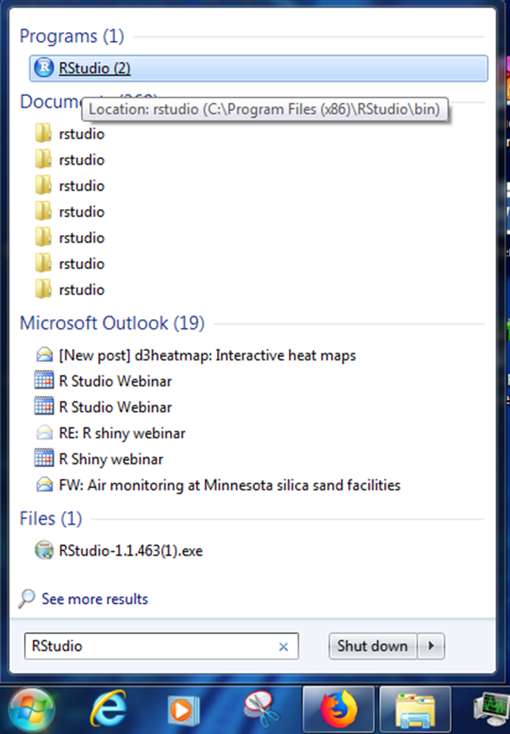
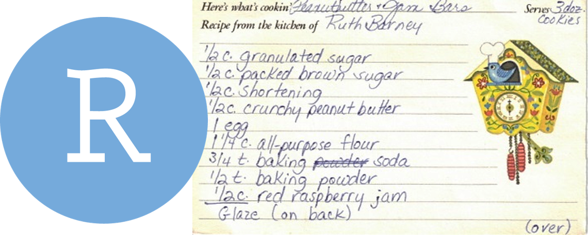

```{r setup, include=FALSE}
library("rmarkdown")
knitr::opts_chunk$set(error=F, message=F, warning=F)
htmltools::tagList(rmarkdown::html_dependency_font_awesome())
```


<h1 style="margin-top: 15px;"> Welcome! </h1>
<hr>

{width="220" style="float: left; margin-right: 34px; margin-bottom: 14px;"}


### Power on your droids
You and BB8 have arrived just in time. Rey needs your help!

Rey needs to travel to Tatooine, but years of scrapping ship parts hasn't been kind to her lungs. Using historic pollution levels your goal is to find the best month for Rey to visit the dusty surface of Tatooine. 


## Open _RStudio_

<div style="width: 48%; float: left; margin-right: 5%; margin-top: -14px;">

{style="width: 88%; margin-top: -35px; margin-bottom: -6px;"}

- __Where's my R!__ _Need to install R or RStudio? Jump over to [Get R!](../page/install.html)_
- __Install troubles?__ _Don't worry, you can use R online at [RStudio Cloud](https://rstudio.cloud/)._


<br>
<br>

</div>


{style="width: 36%;"}

<div style="clear: both;"></div>


# Introductions
<hr>

### Good morning! 

We are Melinda, Vallen, Jaime, Kristie & Dorian.  

We like __R__.

We aren't computer scientists and that's okay! 

We make lots of mistakes. You can laugh at us. 


## All together now {-}

Let's launch ourselves into the unknown and use R to introduce ourselves. Consider this an RStudio warm-up. We'll use R to introduce ourselves and the data we love.

{align="right" style="width: 50%; margin-left: 26px; margin-top: 38px;"}

__Share:__  

<div class="note" style="margin-top: 0;">

- Your name  
- Distance you traveled to get here
- Types of data you have
- A snack you want right now
- The messiest, weirdest, funniest part of your data

__Good news:__ _If you do something with data over and over again, this could be something you can automate in R._ 

</div>

<br>

- In R Studio click on __File > New File > R Script__. You will see a code editor window open. 

{style="width: 70%; margin-bottom: 18px;"}

- You will be writing and saving code in this window. This is your code editor.  

## Create and store values

You can assign values to new objects using the "left arrow". 

> __Left arrow__ 
> `x  <-  5 `

This is written by typing a less-than sign followed by a hyphen. It's more officially known as the _assignment operator_. Try adding the code below to your R script and assign a value to an object called `my_name`.

<br>

#### __Let's try it__
```{r, introductions}

my_name <- "Your Name" # Text and characters are put in quotes

miles_traveled <- 1869 # A number

# A list of data I use
my_data_types <- c("PAHs", "Air Toxics", "Ultrafine particles") 

best_snack_in_the_universe <- "Air Heads" 

```


<br>

Now, you can type _`my_name`_ into your console (lower left hand quadrant) and your entry will be returned.

```{r, introductions_results}

my_name

miles_traveled
```

<br>

> To run everything at once, you can highlight all of the code you've written in the _Code Editor_ and push `CTRL + ENTER`.


## It's ALL about you

Now we can create a data table, which is also called a `data.frame()`.
```{r, intros_tbl}
# Put the 4 items into a table
all_about_me <- data.frame(name           = my_name, 
                           miles_traveled = miles_traveled, 
                           data_types     = my_data_types,  
                           best_snack     = best_snack_in_the_universe)
```


Let's bounce around the room and introduce ourselves with help from our R scripts.


<details style="margin-top: 34px;">
<summary class="btn_code"> __GET R PACKAGES__ </summary>

<div class="quiz" style="margin-top: -8px; border-radius: 0;">

<p>

To use a new _package_ in R you first need to install it -- much like a free App on your phone. To save time on installation, you can copy the text below and paste it into the RStudio console found on the left-side of the screen when you open RStudio. 


```{r, eval=F}
new_packages <- c("readr", "readxl", "ggplot2", "lubridate", "leaflet", "sf")

install.packages(new_packages)

```


<p style="margin-top: 5px;">
Then press `ENTER` to begin the installation. If all goes well, you should start to see some messages appear similar to this, which provide information on the installation progress.


</p>

__Congrats rebel droid!__ <i class="fa fa-android" style="font-size: 44px;"></i> 

</p></div>
</details>

<br>


## Today's challenge
<hr>

{width="254" style="float: left; margin-right: 24px; margin-bottom: 14px;"}

<br>

> Rey needs to visit Tatooine to help the Rebel Alliance, and we have ozone data to help her decide what month we should visit -- preferrably the month with the lowest ozone concentration. The goal for today is to give Rey a nice chart of monthly ozone concentrations to help her plan.

<br>

To complete this challenge we'll follow the general roadmap below. 

<div style="clear: both;"></div>

### Today's workflow

<div class="note">

1. __READ__ the data
1. __[PLOT]__ the data
1. __CLEAN__ the data
- __[PLOT]__ some more
4. __SUMMARIZE__ the data
- __[PLOT]__ even more
5. __SAVE__ the results
6. __SHARE__ with friends

</div>

# But why R? 
<hr>

{style="width: 95%;"}

## R Community
See the [R Community](community.html) page.

- [R support and community](https://itep-r.netlify.com/page/community.html)
- ITEP page for sharing (https://github.com/itep-data/R-questions) Look at the example script for cleaning headers!
- Finding R Help https://itep-r.netlify.com/page/help.html

## When to use R?

- To connect to databases.
- To read data from websites.
- To document and share methods.
- When data will have frequent updates.
- When we want to improve a process over time.


## R is for reading 

{style="width: 55%; float: left; margin-right: 28px; margin-left: -16px;"}

Lucky for us, programming doesn't have to be a bunch of math equations. R allows you to write your data analysis in a step-by-step fashion, much like creating a recipe for cookies. And just like a recipe, we can start at the top and read our way down to the bottom. 


<div style="clear: both;"></div>

<br>

## It begins!

### Start an R project 

We'll make a new project for our investigation of ozone on Tatooine.

<div class="well" style="margin-left: 5%;">

__Step 1:__ Start a new project

- In _Rstudio_ select _File_ from the top menu bar
    - Choose _New Project..._
    - Choose _New Directory_
    - Choose _New Project_
- Enter a project name such as `"NTF-2019"`
- Select _Browse..._ and choose a folder where you normally perform your work. 
    - Click _Create Project_

__Step 2:__ Open a new script 

- __File > New File > R Script__
    - Click the _floppy disk_ save icon
    - Give it a name: `Rey.R` or `ozone.R` will work well

</div>

# A grand tour 

{style="width: 85%;"}

<br>

<div class="red-note">
__1. Code Editor__ 

This is where you write your scripts and document your work. The tabs at the top of the code editor allow you to view scripts and data sets you have open. This is where you'll spend most of your time.
</div>

<div class="red-note">
__2. Console__ 

This is where code is actually executed by the computer. It shows code that you have run and any errors, warnings, or other messages resulting from that code. You can input code directly into the console and run it, but it won't be saved for later. That's why we like to run all of our code directly from a script in the code editor.
</div>

<div class="red-note">
__3. Workspace__ 

This pane shows all of the objects and functions that you have created, as well as a history of the code you have run during your current session. The environment tab shows all of your objects and functions. The history tab shows the code you have run. Note the _broom_ icon below the Connections tab. This cleans shop and allows you to clear all of the objects in your workspace.
</div>

<div class="red-note">
__4. Plots and files__ 

These tabs allow you to view and open files in your current directory, view plots and other visual objects like maps, view your installed packages and their functions, and access the help window. If at anytime you're unsure what a function does, enter it's name after a question mark. For example, try entering `?mean` into the console and push __ENTER__.
</div>


# First steps 

# 1. | Read the data 
<hr>

{style="width: 20%; float: left; margin-right: 4px;"}

<br>

<div style="width: 79%; float: right;">
```{r read-data}
library(readr)

air_data <- read_csv("https://itep-r.netlify.com/data/OZONE_samples.csv")
```

</div>

<div style="clear: both;"></div>

```{r tbl, echo=F}
library(knitr)
library(dplyr)

air_data %>% sample_n(5) %>% select(SITE, Date, Hour, OZONE, TEMP_F) %>% kable()
```


##	Clean header names 
<hr>

{style="width: 17%; float: right;"}

{style="width: 17%; float: right; margin-left: 30px;"}

<br>

There are two great packages that can help us with cleaning header names. Let's install them!

<br>

<div style="clear: both;"></div>


### Install new packages
```{r, eval=F}
install.packages("janitor")
install.packages("dplyr")
```


### Load packages from your personal `library()`
```{r headers}
library(janitor)
library(dplyr)

# General cleaning for all columns
air_data <- clean_names(air_data)

# Change and set specific names
air_data <- rename(air_data,
                   lat = latitude,
                   lon = longitude)

```


# 2. | Plot the data {-}
<hr>

{style="width: 22%; float: left; margin-right: 4%;"}

<br>


```{r view, fig.width=12, fig.height=4}
library(ggplot2)

ggplot(air_data, aes(x = temp_f, y = ozone, color = site)) + 
    geom_point(size = 7, alpha = 0.3) 
```

<div style="clear: both;"></div>


# Explore the data
<hr>

Some functions to get to know your data.


| Function        | Information                 |  
|:----------------|:----------------------------|  
| `names(scrap)`  | column names                |  
| `nrow(...)`     | number of rows              |  
| `ncol(...)`     | number of columns           | 
| `summary(...)`  | summary of all column values (ex. _max_, _mean_, _median_)  | 
| `glimpse(...)`  | column names + a glimpse of first values (requires _dplyr_ package)   |  


## `glimpse()` and `summary()` 

Use the `glimpse()` function to find out what type and how much data you have.

Use the `summary()` function to get a quick report of your numeric data.


```{r glimpse}
library(dplyr)

# Glimpse the columns of your data and their first few contents
glimpse(air_data)
```

```{r summary-airdata}
# Show numeric summary of the min, mean, and max of all columns
summary(air_data)
```

```{r summary-try, eval=F}

# Try the rest on your own
nrow()

ncol()

names()

```


# 3. | Clean the data 
<hr>


### Filter out values that are out-of-range 
```{r clean}

# Drop values out of range
air_data <- filter(air_data, ozone > 0)

# We can filter with two conditions
air_data <- filter(air_data, ozone > 0, temp_f < 199) 

```

### Check the units column
```{r distinct}

# Show all unique values in the units column
distinct(air_data, units)

```


PPM! That explains the tiny results. It looks like we may need to fix the units on some of these ozone values. For that we'll want to call the friendly `dplyr` package.


## It's time for `dplyr` 
<hr>

<i class="fas fa-toolbox"></i> __Your analysis toolbox__ 

<div class="notes">

| Function      | Job                                                 |  
|:--------------|:----------------------------------------------------|  
| `select()`    | Select individual columns to drop, keep, or reorder |  
| `arrange()`   | Reorder or sort rows by value of a column           |  
| `filter()`    | Pick a subset of rows by the value of a column      | 
| `mutate()`    | Add new columns or update existing columns          | 
| `summarize()` | Calculate a single summary for the entire table     |   
| `group_by()`  | Split data into groups by values in a column        |  

</div>


# Porg example 

We recruited a poggle of porgs to help demo the `dplyr` functions. As you can see in the table below, there are two types: yellow and gray. 

```{r porg-tabs, results='asis', echo=F}
cat(readLines("../page/porg_tabs.txt"))
```


## Fix the units
### `mutate()`

```{r mutate}

# Convert all samples to PPB
air_data <- mutate(air_data, 
                   ozone_ppm = ozone * 1000) 
```


# `Lunch break` <i class="fa fa-utensils"></i> ☕

{style="width: 58%; align: center;"}


# Dates 
<hr>

### The `lubridate` package

{style="width: 22%; float: left; margin-right: 30px; margin-top: 8px; margin-bottom: 12px;"}


<br>

It's about time! Lubridate makes working with dates easier. 

We can do date math, add and subtract days, and make seasonal and day of the week averages. 

<br>


<div style="clear: both;"></div>

__Date functions__

{style="width: 35%; float: left;"}

{style="width: 50%;"}

<div style="clear: both;"></div>

## Clean the dates
```{r lubridate}
library(lubridate) 

# Set date column to official date format
## We'll use "mdy()" because our dates are written as month-day-year
air_data <- mutate(air_data, date = mdy(date))

# Add a month and day of the week columns
air_data <- mutate(air_data, month = month(date),
                             day   = day(date)) 
```

<br>

# Guess Who? 
<h2 style="margin-top: -24px;"> _Star Wars edition_ </h2>

{width="280" align="right" style="margin-top: -65px; margin-left: 24px; margin-right: 36px;"}

> Are you the best Jedi detective out there? Let's play a game to find out. 

<br>

Guess what else comes with the `dplyr` package? A **Star Wars data set**.

You can open the data set with the following steps:

1. Load the `dplyr` package from your `library()`
1. Pull the Star Wars dataset into your environment.
    

```{r}
library(dplyr)

starwars_data <- starwars
```


## <span style="text-decoration: underline;"> Rules </span> 

1. Scroll through the Star Wars dataset and find a character you find interesting.
   - Or run `sample_n(starwars_data, 1)` to choose your character at random.
1. __Keep it hidden!__ Don't show your neighbor the character you chose.
1. Take turns asking each other questions about your partner's Star Wars character. 
1. Use the answers to build a `filter()` function and narrow down the potential character your neighbor may have picked. 


For example: Here's a `filter()` statement that filters the data to the character _Plo Koon_.

<div style="width: 90%; margin-left: 8%">
```{r, eval=F}
mr_koon <- filter(starwars_data,
                  mass       < 100,
                  eye_color  != "blue",
                  gender     == "male",
                  homeworld  == "Dorin",
                  birth_year > 20)

```
</div>

5. _Elusive_ answers are encouraged.
    - For example, if someone asks: _What is your character's mass?_ 
    - You can respond: _My character's mass is equal to one less than their age._ 
    - Or if you're feeling generous you can give a more straight forward answer such as: _My character's mass is definitely more than 100 and less that 140._
6. Sometimes a character will not have a specific attribute. We learned earlier how R stores nulls as `NA`. If your character has a missing value for hair color, one of your filter statements could be `is.na(hair_color)`. 

<br>

<span style="margin-top: 18px; color: green;"> __WINNER!__ </span>

The winner is the first to guess their neighbor's character.


<details>
<summary class = "btn_code_green"> __WINNERS Click here!__ </summary>

<div class="data">
<p>

<div style="height: 538px; max-height: 538px; margin: 20px; margin-left: 2px; overflow: hidden;">


</div>

</p></div>
</details>


<br>

<div class="note">

#### Want to rematch? 

How about make it best of __3__ games? Or switch partners and try again.

</div>


# 4. | Plot (again!)
```{r, fig.width=13, fig.height=5}
ggplot(air_data, aes(x = date, y = ozone, color = month)) + 
    geom_point(alpha = 0.2, size = 3) 
```


# left_join() - combining tables

## Polar plot

## Calendar plot


# 5. | Group and Summarize the data 

`group_by()`

```{r grouped}
air_data_group <- group_by(air_data, month)

```


```{r summarise}
air_data_summary <- summarize(air_data_group, avg_ozone = mean(ozone))
```


```{r, echo=F}
air_data_summary %>% knitr::kable()
```


# 6. | Save results

### Save the summarized data table
```{r save-csv, eval=F}
write_csv(air_data_summary, "2015-2017_ozone_summary.csv")
```


### Plot the summarized data 
```{r, fig.width=12, fig.height=4}
ggplot(air_data_summary, aes(x = month, y = avg_ozone, fill = avg_ozone)) + 
    geom_col(width = 0.9)

```


### Save plots 
```{r, fig.width=12, fig.height=4, eval=F}
ggplot(air_data_summary, aes(x = month, y = avg_ozone, fill = avg_ozone)) + 
    geom_col(width = 0.9) +
    ggsave("Ozone_by_month.png")

```


# 7. | Share with friends

Having an exact record of what you did can serve as great documentation for yourself and others. So next year when your coworker asks why they're getting a different answer for the average ozone concentration in 2016, or why you dropped some values from the data, you'll be able to tell them. Or when the lab gets back to you and lets you know the ozone observations were okay on the day that the instrument recorded ridiculously high temperatures, you can update that line in the script and push re-run.
 
## Share on GitHub

<a href = "https://github.com/dKvale/ex__OZONE__Project">
{style="width: 90%;"}
</a>


## Congratulations! 
You've added some great tools to your data analysis tool belt. Now go forth and put them to use.

### More data awaits you... 

{style="width: 70%; margin-left: 10%;"}


# Customize R Studio 

#### Make it your own

Let's add a little style so R Studio feels like home since you will spend lots of time here. Follow these steps to change the font-size and and color scheme: 

1. Go to __Tools__ on the top navigation bar. 
2. Choose `Global Options...`
3. Choose `Appearance` with the paint bucket.
4. Find something you like.


<br>


# <i class="far fa-question-circle" aria-hidden="true"></i> Help!

Lost in an ERROR message? Is something behaving strangely and want to know why? 

See the [Help!](help.html) page for some troubleshooting options.


# <i class="fas fa-key fa-xs" style="color: #c81888;" aria-hidden="true"></i> Key terms
  
|    |                                                                  |   
|----|:----------------------------------------------------------------:|  
|`package  `| An add-on for R that contains new functions that someone created to help you. It's like an App for R.  |  
|`library  `| The name of the folder that stores all your packages, and the function used to load a package.  |  
|`function  `| Functions perform an operation on your data and returns a result. The function `sum()` takes a series of values and returns the sum for you.  |  
|`argument  `| Arguments are options or inputs that you pass to a function to change how it behaves. The argument `skip = 1` tells the `read_csv()` function to ignore the first row when reading in a data file. To see the default values for a function you can type `?read_csv` in the console.  |  

<br>

### <i class="fa fa-rocket" aria-hidden="true"></i> Return to [Homebase](../../index.html) {-}
