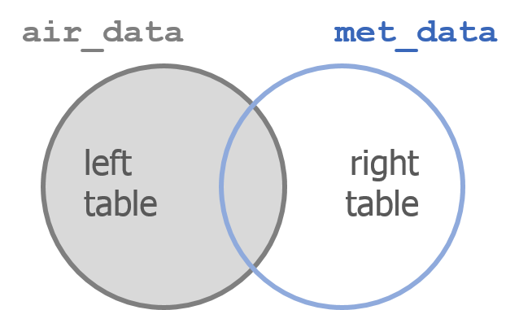

```{r setup, include=FALSE}
library("rmarkdown")
knitr::opts_chunk$set(error=F, message=F, warning=F)
htmltools::tagList(rmarkdown::html_dependency_font_awesome())
```


<h1 style="margin-top: 35px;"> Welcome! </h1>
<hr>

{width="220" style="float: left; margin-right: 34px; margin-bottom: 14px;"}


### Power on your droids
You and BB8 have arrived just in time. Rey needs your help!

Rey has to travel to Tatooine, but years of scrapping ship parts hasn’t been kind to her lungs. Using past pollution levels, let's find the best month for Rey to visit the dusty surface of Tatooine.

## Open _RStudio_

<div style="width: 48%; float: left; margin-right: 5%; margin-top: -14px;">

{style="width: 88%; margin-top: -35px; margin-bottom: -6px;"}

- __Where's my R!__ _Need to install R or RStudio? Jump over to [Get R!](../page/install.html)_
- __Install troubles? No permissions?__ _No worries. You can use R online at [RStudio Cloud](https://rstudio.cloud/)._


<br>
<br>

</div>


{style="width: 36%;"}

<div style="clear: both;"></div>


# Introductions
<hr>

### Good morning! 

We are Melinda, Vallen, Jaime, Kristie & Dorian.  

We like __R__.

We aren't computer scientists and that's okay! 

We make lots of mistakes. Mistakes are funny. You can laugh with us. 


## All together now {-}

Let's launch ourselves into the unknown and use R to store some data. We’re going to use R to introduce a friend and the data they love. Find a partner and learn 3 things about them.

<br>

{align="right" style="width: 50%; margin-left: 26px; margin-top: 38px;"}

__Things to Share__  

<div class="note" style="margin-top: 0;">

- Your name  
- How far you traveled to here
- Types of air data you have
- Something you hope to use R for
- A favorite snack
- How many pets you have
</div>

<br>

- In R Studio click on __File > New File > R Script__. You will see a code editor window open. 

{style="width: 70%; margin-bottom: 18px;"}

- You will be writing and saving code in this window. This is your code editor.  

## Create and store values

You can assign values to new objects using the "left arrow", which is written as `<-`. 

> __Left arrow__ 
>
> `x  <-  5 `


This is typed using a less-than sign followed by a hyphen. It's more officially known as the _assignment operator_. Try adding the code below to your R script and assign a value to an object called `partner`.

<br>

### Create values 
```{r, introductions}

my_partner <- "Partner's Name" # Text and characters are put in quotes

miles_traveled <- 1160 # A number has no quotes

# A list of data I use
data_types <- c("PAHs", "Ozone", "Fine particles") 

best_snack_ever_99 <- "Air Heads" 

```


### View values 

Now you can type _`partner`_ and run that line to see the value stored in that variable.

```{r, introd_view}
my_partner
```

<br>


### Copy values
```
nickname <- my_partner

nickname
```

<br>

## Drop and remove data {-}

You can drop objects with the remove function `rm() `. Try it out on some of your objects.

```{r, eval = F}

# Delete objects to clean-up your environment
rm(nickname)

```


<div class="tip">
### <i class="fa fa-user-bicycle" aria-hidden="true" style="color: darkgreen"></i> Exercise! {-}

How can we get the 'my_partner' object back?

__HINT:__ The UP arrow in the Console is your friend.
</div>


<br>

> To run everything in one go, highlight all of the code in the Code Editor and push `CTRL`+`ENTER`. 


## It's ALL about you

Now we can create a data table, which in R is also called a `data.frame` or a `tibble`. When creating one, the column names go on the _left_, and the values you want to put in the column go on the _right_.

```{r, intros_tbl}
# Put the items into a table
all_about_you <- data.frame(name           = my_partner, 
                            miles_traveled = miles_traveled, 
                            data_types     = data_types,  
                            best_snack     = best_snack_ever_99)
```


Let's bounce around the room and introduce ourselves with help from our new data frames.


<details style="margin-top: 34px;">
<summary class="btn_code"> __GET R PACKAGES__ </summary>

<div class="quiz" style="margin-top: -8px; border-radius: 0;">

<p>

To use a new _package_ in R you first need to install it -- much like a free App on your phone. To save time on installation, you can copy the text below and paste it into the RStudio _Console_. It's the quadrant on the lower left when you open RStudio. The one with the `>` symbols.


```{r, eval=F}
new_packages <- c("readr", "readxl", "dplyr", "stringr",
                  "ggplot2", "lubridate", "janitor", "curl")

install.packages(new_packages)

```


<p style="margin-top: 5px;">
Then press `ENTER` to begin the installation. If all goes well, you should start to see some messages appear similar to these:


</p>

__Congrats rebel droid!__ <i class="fa fa-android" style="font-size: 44px;"></i> 

</p></div>
</details>

<br>


# Why R? 
<hr>

{style="width: 95%;"}

## R Community

- See the [R Community](../page/community.html) page.
- ITEP page for sharing & questions - [R questions](https://github.com/itep-data/R-questions)
- Finding R Help - [Get help!](https://itep-r.netlify.com/page/help.html)
    - R cheatsheets

## When do we use R?

- To connect to databases
- To read data from websites
- To document and share methods
- When data will have frequent updates
- When we want to improve a process over time


## R is for reading 

{style="width: 55%; float: left; margin-right: 28px; margin-left: -16px; margin-top: 8px;"}

Lucky for us, programming doesn't have to be a bunch of math equations. R allows you to write your data analysis in a step-by-step fashion, much like creating a recipe for cookies. And just like a recipe, we can start at the top and read our way down to the bottom. 


<div style="clear: both;"></div>

<br>

## It begins!


## Today's challenge
<hr>

{width="254" style="float: left; margin-right: 24px; margin-bottom: 14px;"}

<br>

> Rey needs to visit Tatooine to help the Rebel Alliance, and we have ozone data to help her decide what month she should visit. Preferably the month with the lowest ozone concentrations. Let's give Rey a nice reference chart of monthly ozone concentrations to help her plan.

<br>

We'll follow the general roadmap below. 

<div style="clear: both;"></div>

### Today's workflow

<div class="note">

1. __READ__ the data
1. __PLOT__ the data
1. __CLEAN__ the data
- ( __PLOT__ some more )
4. __SUMMARIZE__ the data
- ( __PLOT__ even more )
5. __SAVE__ the results
6. __SHARE__ with friends

</div>


### Start an R project 

We'll make a new project for our investigation of ozone on Tatooine.

<div class="well" style="margin-left: 5%;">

__Step 1:__ Start a new project

- In _Rstudio_ select _File_ from the top menu bar
    - Choose _New Project..._
    - Choose _New Directory_
    - Choose _New Project_
- Enter a project name such as `"NTF_2019"`
- Select _Browse..._ and choose a folder where you normally perform your work. 
    - Click _Create Project_

__Step 2:__ Open a new script 

- __File > New File > R Script__
    - Click the _floppy disk_ save icon
    - Give it a name: `ozone.R` will work well

</div>

# RStudio - The grand tour 

{style="width: 85%;"}

<br>

<div class="red-note">
__1. Code Editor__ 

This is where you write your scripts and document your work. The tabs at the top of the code editor allow you to view scripts and data sets you have open. This is where you'll spend most of your time.
</div>

<div class="red-note">
__2. Console__ 

This is where code is executed by the computer. It shows code that you have run and any errors, warnings, or other messages resulting from that code. You can input code directly into the console and run it, but it won't be saved for later. That's why we like to run all of our code directly from a script in the code editor.
</div>

<div class="red-note">
__3. Workspace__ 

This pane shows all of the objects and functions that you have created, as well as a history of the code you have run during your current session. The environment tab shows all of your objects and functions. The history tab shows the code you have run. Note the _broom_ icon below the Connections tab. This cleans shop and allows you to clear all of the objects in your workspace.
</div>

<div class="red-note">
__4. Plots and files__ 

These tabs allow you to view and open files in your current directory, view plots and other visual objects like maps, view your installed packages and their functions, and access the help window. If at anytime you're unsure what a function does, enter it's name after a question mark. For example, try entering `?mean` into the console and push __ENTER__.
</div>


# First steps 

# 1. | Read the data 
<hr>

{style="width: 18%; float: left; margin-right: 6px;"}

<br>

<div style="width: 81%; float: right;">
```{r read-data}
#install.packages("readr")
library(readr)

air_data <- read_csv("https://itep-r.netlify.com/data/ozone_samples.csv")

```

</div>

<div style="clear: both;"></div>

```{r tbl, echo=F}
library(knitr)
library(dplyr)

air_data %>% sample_n(5) %>% kable()
```


##	Clean header names 
<hr>

{style="width: 17%; float: right; margin-right: 6px; margin-left: 6px;"}

{style="width: 17%; float: right; margin-left: 30px;"}

<br>

There are two great packages that can help us with cleaning header names. Let's install them!

<br>

<div style="clear: both;"></div>


### Install new packages
```{r, eval=F}
install.packages("janitor")
install.packages("dplyr")
```


### Load packages from your personal `library()`
```{r headers}
library(janitor)
library(dplyr)

# General cleaning for all columns
air_data <- clean_names(air_data)

# Change and set specific names
air_data <- rename(air_data,
                   lat = latitude,
                   lon = longitude)

```

__View the new names__
```{r}
names(air_data)
```


# <span class="fa-stack fa-1x"><i class="fa fa-circle fa-stack-1x gray"></i><strong class="fa-stack-1x">1</strong></span> | Plot the data 


#### _Plot the data, Plot the data, Plot the data_ {-}


{style="width: 22%; float: left; margin-right: 4%;"}

<br>


```{r view, fig.width=12, fig.height=4}
#install.packages("ggplot2")
library(ggplot2)

ggplot(air_data, aes(x = temp_f, y = ozone, color = site)) + 
    geom_point(size = 7, alpha = 0.3) 
```

<div style="clear: both;"></div>


## Break it down now


## The `ggplot()` sandwich {-}


{style="margin-top: -22px; margin-left: -40px; max-width: 110%;"}

<h5 style="font-size: 28px; font-weight: bold; margin-top: -42px;"> A `ggplot` has 3 ingredients. </h5>


## 1. The base plot {-}
```{r, echo=T, eval=T}
library(ggplot2)
```

```{r, echo=T, eval=T}
ggplot(air_data)
```


## 2. The the X, Y _aesthetics_  {-}

The _aesthetics_ assign the components from the data that you want to use in the chart. These also determine the dimensions of the plot.

```{r, eval=T}
ggplot(air_data, aes(x = temp_f, y = ozone)) 
```


## 3. The layers or _geometries_  {-}
```{r, eval=T}
ggplot(air_data, aes(x = temp_f, y = ozone)) + geom_point()
```

<br>

<div class="tip">
#### <i class="fa fa-cogs" aria-hidden="true" style="color: green"></i> EXERCISE {-}

Try making a scatterplot of any two columns. Here's a template to help get you started.

```{r, eval = F, echo = T}
ggplot(air_data, aes(x = column1, y = column2 )) + geom_point()
```


_Hint: Numeric variables will be more exciting._

</div>

> we load the package `library (ggplot2)`, but the function to make a plot is `ggplot(scrap)`. 


# <span class="fa-stack fa-1x"><i class="fa fa-circle fa-stack-1x gray"></i><strong class="fa-stack-1x">1</strong></span> | Explore the data

Some functions to get to know your data.


| Function        | Information                 |  
|:----------------|:----------------------------|  
| `names(air_data)`  | column names                |  
| `nrow(...)`     | number of rows              |  
| `ncol(...)`     | number of columns           | 
| `summary(...)`  | a summary of all column values (ex. _max_, _mean_, _median_)  | 
| `glimpse(...)`  | column names + a glimpse of first values (use _dplyr_ package)   |  


## `glimpse()` and `summary()` 

Use the `glimpse()` function to find out what type and how much data you have.

Use the `summary()` function to get a quick report of your numeric data.


```{r glimpse}
library(dplyr)

# Glimpse the columns of your data and their first few contents
glimpse(air_data)
```

```{r summary-airdata}
# Show numeric summary of the min, mean, and max of all columns
summary(air_data)
```

```{r summary-try, eval=F}

# Try the rest on your own
nrow()

ncol()

names()

```


# 4. | Clean the data 
<hr>

## It's time for `dplyr` 
<hr>

{width="128" align="left" style="margin-right: 32px; margin-top: 8px; margin-bottom: 20px;"}

<br>

This is our go-to package for most analysis tasks. With the six functions below you can accomplish just about anything you want to.

<br>

> ###  <i class="fa fa-toolbox" aria-hidden="true" style="color: grey;"></i> Your new analysis toolbox {-}
>
> | Function      | Job                                                 |  
> |:--------------|:----------------------------------------------------|  
> | `select()`    | Select individual columns to drop or keep           |  
> | `arrange()`   | Sort a table top-to-bottom based on the values of a column |  
> | `filter()`    | Keep only a subset of rows depending on the values of a column      | 
> | `mutate()`    | Add new columns or update existing columns          | 
> | `summarize()` | Calculate a single summary for an entire table     |   
> | `group_by()`  | Sort data into groups based on the values of a column  |  


# Porg example 

We recruited a poggle of porgs to help demo the `dplyr` functions. There are two types of porgs: yellow-eyes and gray-eyes. 

```{r porg-tabs, results='asis', echo=F}
cat(readLines("../page/porg_tabs.txt"))
```

<br>

### Filter out values that are out-of-range 
```{r clean}

# Drop values out of range
air_data <- filter(air_data, ozone > 0)

# We can filter with two conditions
air_data <- filter(air_data, ozone > 0, temp_f < 199) 

```

### Check the units column
```{r distinct}

# Show all unique values in the units column
distinct(air_data, units)

```


PPM? That explains the tiny results. Let's convert to `PPB`. For that we'll want our friend the `mutate` function.


## Convert units

### `mutate()`

For `mutate`, the name of the column goes on the _left_, and the calculation of its new value goes on the _right_. 

__Update the column `ozone`__
```{r mutate}

# Convert all samples to PPB
air_data <- mutate(air_data, ozone = ozone * 1000) 
```

__Update the column `units`__
```{r mute-units}

# Set units column to PPB
air_data <- mutate(air_data, units = "PPB") 
```


<br><br><hr>

{style="width: 56%; float: left; margin-right: 11px;"}

# <i class="fa fa-utensils"></i> ☕ `Lunch break` 

<div style="clear: both;"></div>

<br><br><hr><br>

# Dates 
<hr>

### The `lubridate` package

{style="width: 22%; float: left; margin-right: 30px; margin-top: 8px; margin-bottom: 12px;"}


<br>

It's about time! Lubridate makes working with dates easier. 
We can find how much time has elapsed, add or subtract days, and find seasonal and day of the week averages. 

<br>

<div style="clear: both;"></div>

<br>

### Get date parts {-}

| Function   |  Date element                                            |   
|-----|:-----------------------------------------------------------------|  
|`year()  `    | Year          |  
|`month()  `   | Month as _1,2,3_; For _Jan, Feb, Mar_ use `label=TRUE`  |  
|`day()  `     | Day of the month  |  
|`wday()`      | Day of the week as _1,2,3_; For _Sun, Mon, Tue_ use `label=TRUE` |  
| _- Time -_ |            | 
|`hour() `   |  Hour of the day _(24hr)_ |  
|`minute() ` |  Minutes   |  
|`second() ` |  Seconds   |  
|`tz()  `    |  Time zone |  


<br>

### Convert text to a *DATE* {-}

| Function    |  Order of date elements                                 |   
|----|:-----------------------------------------------------------------|  
|`mdy()  `    | Month-Day-Year :: `05-18-2019` or `05/18/2019`                 |  
|`dmy()  `    | Day-Month-Year (Euro dates) :: `18-05-2019` or `18/05/2019`    |  
|`ymd()  `    | Year-Month-Day (science dates) :: `2019-05-18` or `2019/05/18` |  
|`ymd_hm() `  | Year-Month-Day Hour:Minutes ::  `2019-05-18 8:35 AM`          |  
|`ymd_hms() ` | Year-Month-Day Hour:Minutes:Seconds ::  `2019-05-18 8:35:22 AM`    | 


## <i class="fa fa-broom" aria-hidden="true"></i> Clean the dates

Let's set our date column to the standard date format. Because our dates are written as `year-month-day hour:mins`, we can Use `ymd_hm()`. 

```{r lubridate}
library(lubridate) 

# Set date column to official date format
air_data <- mutate(air_data, date_time = ymd_hms(date_time))

# Now we can add a variety of date and time columns to our data
air_data <- mutate(air_data, 
                   date  = date(date_time),
                   hour  = hour(date_time),
                   month = month(date_time, label = TRUE),
                   day   = wday(date_time, label = TRUE),
                   year  = year(date_time)) 
```

<br>


# Comparisons
<hr>

Processing data requires many types of filtering. You'll want to know how to select observations in your table by making various comparisons between values.

__Key comparison operators__

| Symbol | Comparison               |
|:-------|:-------------------------|
| `>`    | greater than             |
| `>=`   | greater than or equal to |
| `<`    | less than                |
| `<=`   | less than or equal to    |
| `==`   | equal to                 |
| `!=`   | NOT equal to             |
| `%in%` | value is in a list       |


# Guess Who? 
<h2 style="margin-top: -24px;"> _Star Wars edition_ </h2>

{width="280" align="right" style="margin-top: -65px; margin-left: 24px; margin-right: 36px;"}

> Are you the best Jedi detective out there? Let's play a game to find out. 

<br>

Guess what else comes with the `dplyr` package? A **Star Wars data set**.

You can open the data set with the following steps:

1. Load the `dplyr` package from your `library()`
1. Pull the Star Wars dataset into your environment.
    

```{r}
library(dplyr)

starwars_data <- starwars
```


## <span style="text-decoration: underline;"> Rules </span> 

1. You have a __secret__ identity.
1. Scroll through the Star Wars dataset and find a character you find interesting. _(Or run `sample_n(starwars_data, 1)` to choose your character at random.)_
1. __Keep it hidden!__ Don't show your neighbor the character you chose.
1. Take turns asking each other questions about your partner's Star Wars character. 
1. Use the answers to build a `filter()` function and narrow down the potential character your neighbor may have picked. 


For example: Here's a `filter()` statement that filters the data to the character _Plo Koon_.

<div style="width: 90%; margin-left: 8%">
```{r, eval=F}
mr_koon <- filter(starwars_data,
                  mass       < 100,
                  eye_color  != "blue",
                  gender     == "male",
                  homeworld  == "Dorin",
                  birth_year > 20)

```
</div>

6. _Elusive_ answers are encouraged.
    - For example, if someone asks: _What is your character's mass?_ 
    - You can respond: _My character's mass is equal to one less than their age._ 
    - Or if you're feeling generous you can give a more straight forward answer such as: _My character's mass is definitely more than 100 and less that 140._
7. Sometimes a character will not have a specific attribute. We learned earlier how R stores nulls as `NA`. If your character has a missing value for hair color, one of your filter statements could be `is.na(hair_color)`. 

<br>

<h3 style="margin-top: 18px; color:  #a0af49;"> __WINNER!__ </h3>

The winner is the first to guess their neighbor's character.

<details>
<summary class = "btn_code_green"> __WINNERS Click here!__ </summary>

<div class="data" style="margin-top: -6px;">
<p>

<div style="max-height: 338px; margin: 20px; margin-left: 2px; overflow: hidden;">
{width="24%" align="left"} 
{width="24%" align="left"} 
{width="24%" align="left"} 
{width="24%" align="left"} 
</div>

</p></div>
</details>


<details>
<summary class = "btn_code"> __More WINNERS Click here!__ </summary>

<div class="quiz" style="margin-top: -6px;">
<p>

<div style="max-height: 500px; margin: 20px; margin-left: 2px; overflow: hidden;">


</div>

</p></div>
</details>


<br>

<div class="note">

#### Want a rematch? 

How about make it best of __3__ games? Or switch partners and try again.

</div>


# 5. | More plots!

```{r, fig.width=13, fig.height=5}
ggplot(air_data, aes(x = date, y = ozone, color = month)) + 
    geom_point(alpha = 0.2, size = 3) 
```


# Combine tables with `left_join()`

Concentration data and meteorological data often arrive to us separately, but we usually want them joined together for easy plotting.


{style="width: 55%;"}

<br>
<hr>

`left_join()` works like a zipper and combines two tables based on one or more variables. They can have the same name or not. Since it's `left_join`, the entire table on the left side is retained. Anything that matches from the right side is retained and the rest is not retained.


### Adding porg names {-}

Remember our porg friends? How rude of us not to share their names. __Wups!__

Here's a table of their names.

<div style="margin-left: 30px; margin-top: 24px; width: 37%; max-width: 37%; margin-bottom: 22px;">

</div>


<div style="clear: both;"></div>

__Hey now!__ That's not very helpful. Who's who? Let's join their names to the rest of the data.


{style="width: 90%; max-width: 85%;"}

<br>

### __What's the result?__ {-}

<div class="well">
{style="width: 85%; max-width: 85%;"}
</div>

<br>

> __Let's try adding MET data to our ozone observations.__

```{r, fig.width=11, fig.height=4}
met_data <- read_csv("https://itep-r.netlify.com/data/met_data.csv")

ozone_met <- left_join(air_data, met_data, 
                       by = c("date" = "date", 
                              "site" = "site", 
                              "hour" = "hour")) 
glimpse(ozone_met)
```


## Polar plots

When looking at air concentration data, we often want to know what direction the wind is blowing from when an air pollutant tends to be elevated. This can help to answer if the pollution source is local or if it is more of a regionl issue.

Pairing wind direction and air concentration data helps answer these questions and provide further insights. Polar plots are one way to look at wind data and get to know the wind patterns around your air monitors.

<br><br><hr>

```{r polar_sites, eval=F, echo=F}
For this data, we have two monitoring sites. Let's start by looking at the data for only one of the sites.


### Filter to a single year {-}
ozone_met <- filter(ozone_met, year == "27-017-7417")
```

### Plot the wind directions {-}
```{r, polar}
ggplot(ozone_met, aes(x = wd, y = ozone)) + 
      coord_polar(start = 0) +
      geom_point(size = 2, alpha = 0.4) +
      theme_bw() +
      scale_x_continuous(breaks = seq(0, 360, by = 90), expand = c(0,0), lim = c(0, 360), name = "", label = c("","E", "S", "W", "N"))
    
```


<div class="tip">

#### <i class="fa fa-bicycle" aria-hidden="true" style="color: darkgreen"></i> Exercise

Let's experiment with the transparency of the points by changing the value after `alpha =`.   

How does changing the value to `alpha = 0.1` change the chart?   
How about `alpha = 0.9`?
</div>


## Calendar plot

Sometimes with air data we want to know if there is seasonality in the data, or if there were dates with very high values. Calendar plots are great for this. 

<br>

> Let's make this plot for only the year 2015. To do that we'll first use `filter()`.

### Filter to a single year {-}
```{r, calendar_site}
ozone_met <- filter(ozone_met, year == 2015)
```


<br>

> Now we can look at our data by hour for each day of the week.

### Plot concentration by hour for each day of the week {-}
```{r, calendar_day}
ggplot(ozone_met, aes(x = day, y = hour, fill = ozone)) +
  geom_tile(color = "gray", size = 0.5) 

```

<br>

> We can also compare concentrations by day of the week for every month.

### Plot concentration by day of the week for each month {-}
```{r, calendar_month}

ggplot(ozone_met, aes(day, month, fill = ozone)) +
  geom_tile(color = "gray", size = 0.5)

```

<br>

> Lastly, let's compare by day of the week and hour of the day for every month.

### Plot concentration by hour for each day of the week and month {-}
```{r, calendar_year, fig.width=13, fig.height=7, out.width=1000}
ggplot(ozone_met, aes(hour, day, fill = ozone)) +
  geom_tile(color = "gray") +
  facet_wrap(~month)
```

<br>

<div class="tip">
#### <i class="fa fa-bicycle" aria-hidden="true" style="color: darkgreen"></i> Exercise

What do the blank spaces mean? Is there a pattern?

To take a closer look at the missing values you can use `filter()` to select only the Sunday ozone concentrations. Let's look at all the data where the `day == "Sun"` and the hour is between `6` and `10`.

Try completing the code below to get a Sunday table.
```{r, eval=F}

miss_data <- filter(ozone_met,
                          day  ==  ______,
                          hour >   ______,
                          hour <   ______ )
                  

```
</div>


# 6. | Group and Summarize the data 

To calculate a summary statistic for each group in the data we use `group_by()`.

> First we'll group the data by month and by site. This will let us calculate a summary of the ozone concentration for each month of the year and for every site in our data.

```{r grouped}
air_data <- group_by(air_data, month, site)

```

> Next we can use `summarize()` to make a table showing the average ozone concentration. Summarize will automatically include a result for each group that we created above.

```{r summarise}
air_data_summary <- summarize(air_data, avg_ozone = mean(ozone))
```


```{r, echo=F}
air_data_summary %>% knitr::kable()
```

<br>

> Lastly, to ungroup the data we can run the nicely named function `ungroup()`.

```{r}
air_data <- ungroup(air_data)
```

<div class="tip">
#### <i class="fa fa-bicycle" aria-hidden="true" style="color: darkgreen"></i> Exercise

Try running the same summarize code on the data after you use `ungroup()`. 

What do you get?
</div>


# 7. | Save results

> Save the summarized data table

```{r save-csv, eval=F}
write_csv(air_data_summary, "2015-2017_ozone_summary.csv")
```


<details>
<summary class = "btn_code"> __Save to EPA's AQS format__ </summary>

<div class="note" style="margin-top: -6px;">
<p>

AQS format is similar to a CSV, but instead of a `,` it uses the `|` to separate values.

```{r}

```


</p></div>
</details>


> Plot the summarized data 

```{r, fig.width=12, fig.height=4}
ggplot(air_data_summary, aes(x = month, y = avg_ozone, fill = avg_ozone)) + 
    geom_col(width = 0.9) 

```


> Save plots 

```{r, fig.width=12, fig.height=4, eval=F}
ggplot(air_data_summary, aes(x = month, y = avg_ozone, fill = avg_ozone)) + 
    geom_col(width = 0.9) +
    ggsave("Ozone_by_month.png")

```


# 8. | Share with friends

Having an exact record of what you did can be great documentation for yourself and others. It's also handy for when you want to repeat the same analysis on new data. Then all you need to do is copy the script, update the one read data line, and push run to get your new set of fancy charts.
 
## Share on GitHub

<a href = "https://github.com/dKvale/ex__OZONE__Project">
{style="width: 90%;"}
</a>


## Congratulations! 
You've added some great tools to your data analysis tool belt. Now go forth and put them to use.

### More data awaits you... 

{style="width: 70%; margin-left: 10%;"}


# <i class="far fa-question-circle" aria-hidden="true"></i> Help!

Lost in an ERROR message? Is something behaving strangely and want to know why? 

See the [Help!](../page/help.html) page for some troubleshooting options.

<br>

<details style="margin-top: 34px;">
<summary class="btn_code"> <h4 style="font-size: 22px;"> <i class="fas fa-key fa-xs" style="color: #c81888;" aria-hidden="true"></i> Key terms </h4></summary>
<p>

|    |                                                                  |   
|----|:-----------------------------------------------------------------|  
|`package  `| An add-on for R that contains new functions that someone created to help you. It's like an App for R.  |  
|`library  `| The name of the folder that stores all your packages, and the function used to load a package.  |  
|`function  `| Functions perform an operation on your data and returns a result. The function `sum()` takes a series of values and returns the sum for you.  |  
|`argument  `| Arguments are options or inputs that you pass to a function to change how it behaves. The argument `skip = 1` tells the `read_csv()` function to ignore the first row when reading in a data file. To see the default values for a function you can type `?read_csv` in the console.  |  

<br>
</p>
</details>


# Customize R Studio 

#### Make it your own

Let's add a little style so R Studio feels like home since you will spend lots of time here. Follow these steps to change the font-size and and color scheme: 

1. Go to __Tools__ on the top navigation bar. 
2. Choose `Global Options...`
3. Choose `Appearance` with the paint bucket.
4. Find something you like.


<br>

## <i class="fa fa-rocket" aria-hidden="true"></i> Return to [Home](../../index.html) {-}
